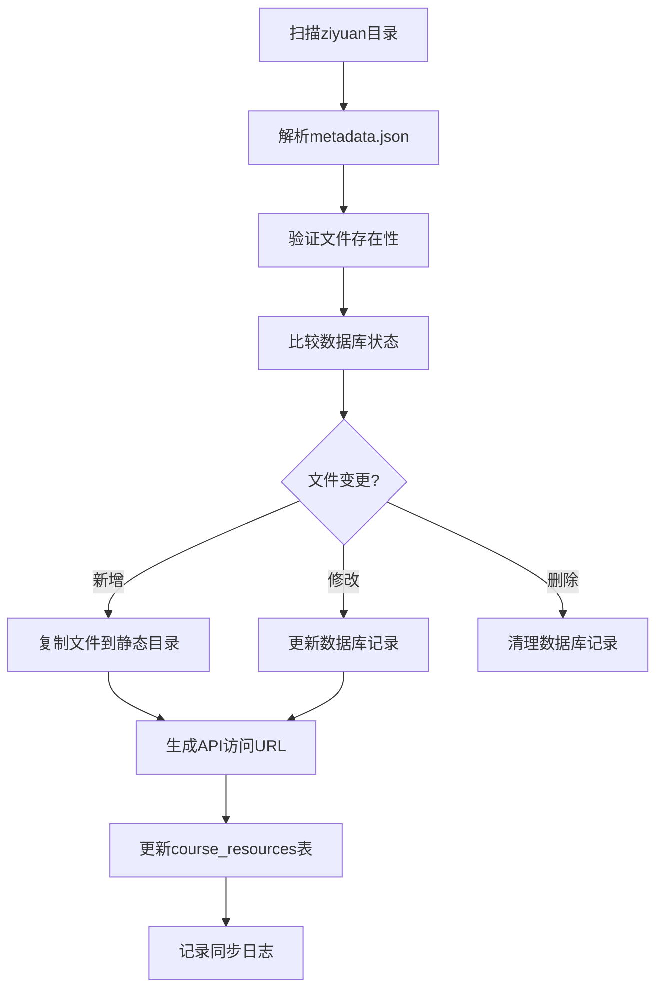

# 慧学高校大数据平台 - 课程实践API文档

## 🎯 项目概述

本项目为慧学高校大数据平台开发了完整的课程实践相关API接口，包括课程资源库、微型实验库、课堂管理等核心功能。

## ✅ 开发完成状态

### 已完成功能
- ✅ **课程资源库API** - 完整实现，支持筛选、搜索、分页
- ✅ **微型实验库API** - 完整实现，支持多维度筛选
- ✅ **课堂管理API** - 基础框架完成（暂时跳过创建功能）
- ✅ **筛选标签API** - 动态获取方向、分类、难度标签
- ✅ **统计信息API** - 平台数据统计
- ✅ **数据库适配** - 完全适配现有数据库结构
- ✅ **测试数据** - 创建了完整的测试数据集

### 测试结果
```
📊 API测试结果 (2025-05-24)
- 课程资源库: ✅ 5个课程，支持完整CRUD
- 微型实验库: ✅ 6个实践，支持筛选查询  
- 筛选标签: ✅ 4个方向，10个分类
- 统计信息: ✅ 实时数据统计
- 服务状态: ✅ 所有API正常响应
```

## 🚀 快速启动

### 1. 启动服务器
```bash
# 方法1: 使用run.py
python run.py

# 方法2: 直接使用uvicorn
python -m uvicorn main:app --host 0.0.0.0 --port 8000

# 方法3: 开发模式（自动重载）
python -m uvicorn main:app --host 0.0.0.0 --port 8000 --reload
```

### 2. 初始化测试数据
```bash
python init_data.py
```

### 3. 访问API文档
- Swagger UI: http://localhost:8000/docs
- ReDoc: http://localhost:8000/redoc
- 健康检查: http://localhost:8000/health

## 📋 API接口列表

### 课程资源库API
- `GET /api/v1/courses` - 课程列表（支持筛选）
- `GET /api/v1/courses/{id}` - 课程详情 **[分页支持]**
- `GET /api/v1/courses/{id}/outline` - 教学大纲
- `GET /api/v1/courses/{id}/resource-statistics` - 教学资源统计 **[新增]**
- `GET /api/v1/courses/{id}/assessments` - 课程考核
- `GET /api/v1/files/resources/{resource_id}` - 资源文件下载 **[新增]**

### 微型实验库API
- `GET /api/v1/practices` - 微型实验列表
- `GET /api/v1/practices/{id}` - 微型实验详情

### 课堂管理API
- `GET /api/v1/classrooms` - 课堂列表
- `GET /api/v1/classrooms/{id}` - 课堂详情
- `POST /api/v1/classrooms` - 创建课堂（待完善）

### 辅助API
- `GET /api/v1/filter-tags/courses` - 课程筛选标签
- `GET /api/v1/filter-tags/practices` - 微型实验筛选标签
- `GET /api/v1/statistics` - 统计信息

## 🔧 技术架构

### 后端技术栈
- **FastAPI** - 现代Python Web框架
- **SQLAlchemy** - ORM数据库操作
- **PostgreSQL** - 数据库
- **Pydantic** - 数据验证和序列化
- **Uvicorn** - ASGI服务器

### 数据库适配
项目完全适配了现有的数据库结构：
- ✅ 枚举类型匹配（difficulty_enum, difficultylevel等）
- ✅ 外键关系正确映射
- ✅ 字段名称完全对应
- ✅ 数据类型兼容

## 📋 详细API规格

### 教学资源API - GET /api/v1/courses/{course_id}/resources

#### 功能描述
获取指定课程的所有教学资源列表，包括PDF、PPT、视频等各种类型的教学材料。

#### 请求参数
| 参数名 | 类型 | 必填 | 默认值 | 描述 |
|--------|------|------|--------|------|
| `course_id` | integer | 是 | - | 课程ID，通过URL路径参数传递 |
| `include_resources` | boolean | 否 | true | 是否包含教学资源列表 |
| `resource_page` | integer | 否 | 1 | 资源列表页码 (当include_resources=true时有效) |
| `resource_page_size` | integer | 否 | 50 | 资源列表每页数量 (1-200，当include_resources=true时有效) |

#### 响应格式

**成功响应 (200)**
```json
{
  "code": "0000",
  "message": "success",
  "data": {
    "id": 2,
    "title": "Python程序设计",
    "description": "Python编程基础课程...",
    "direction": "编程语言",
    "difficulty": "BEGINNER",
    "resources": [
      {
        "id": 1,
        "course_id": 2,
        "title": "1.1 计算机语言.pdf",
        "url": "/api/v1/files/resources/1",
        "resource_type": "pdf",
        "created_at": "2025-10-25T09:00:00Z",
        "can_download": true
      },
      {
        "id": 2,
        "course_id": 2,
        "title": "第一章：Python语言概述.pptx",
        "url": "/api/v1/files/resources/2",
        "resource_type": "ppt",
        "created_at": "2025-10-25T09:00:00Z",
        "can_download": true
      }
    ],
    "resource_pagination": {
      "page": 1,
      "page_size": 50,
      "total": 156,
      "total_pages": 4,
      "has_next": true,
      "has_prev": false
    },
    "chapters": [...],
    "assessments": [...]
  },
  "trace_id": null
}
```

**错误响应**
```json
{
  "code": "2000",
  "message": "服务器内部异常: 数据库连接失败",
  "data": null,
  "trace_id": "abc-123-def"
}
```

#### 响应字段说明

| 字段名 | 类型 | 必填 | 描述 |
|--------|------|------|------|
| `code` | string | 是 | 响应码，"0000"表示成功 |
| `message` | string | 是 | 响应消息 |
| `data` | object | 否 | 课程完整信息对象（包含resources数组和分页信息） |
| `trace_id` | string | 否 | 错误追踪ID |

**课程对象字段说明**
| 字段名 | 类型 | 必填 | 描述 |
|--------|------|------|------|
| `id` | integer | 是 | 课程ID |
| `title` | string | 是 | 课程标题 |
| `resources` | array | 否 | 教学资源列表（分页后的结果） |
| `resource_pagination` | object | 否 | 资源分页信息 |

**资源对象字段说明**
| 字段名 | 类型 | 必填 | 描述 |
|--------|------|------|------|
| `id` | integer | 是 | 资源唯一标识 |
| `course_id` | integer | 是 | 所属课程ID |
| `title` | string | 是 | 资源标题 |
| `url` | string | 是 | 资源访问URL (抽象路径 `/api/v1/files/resources/{id}`) |
| `resource_type` | string | 是 | 资源类型 (pdf, ppt, video, document, markdown等) |
| `created_at` | string | 是 | 创建时间 (ISO 8601格式) |
| `can_download` | boolean | 是 | 是否允许下载 (数据库字段) |

**分页信息字段说明**
| 字段名 | 类型 | 必填 | 描述 |
|--------|------|------|------|
| `page` | integer | 是 | 当前页码 |
| `page_size` | integer | 是 | 每页数量 |
| `total` | integer | 是 | 总资源数量 |
| `total_pages` | integer | 是 | 总页数 |
| `has_next` | boolean | 是 | 是否有下一页 |
| `has_prev` | boolean | 是 | 是否有上一页 |

#### 支持的资源类型

平台支持以下文件类型的教学资源：

**文档文件**
- `pdf` - PDF文档 (application/pdf)
- `doc` - Word文档 (application/msword)
- `docx` - Word文档 (application/vnd.openxmlformats-officedocument.wordprocessingml.document)
- `txt` - 纯文本文件 (text/plain)
- `md` / `markdown` - Markdown文档 (text/markdown)
- `json` - JSON配置文件 (application/json)

**演示文稿**
- `ppt` - PowerPoint演示文稿 (application/vnd.ms-powerpoint)
- `pptx` - PowerPoint演示文稿 (application/vnd.openxmlformats-officedocument.presentationml.presentation)

**表格文件**
- `xls` - Excel表格 (application/vnd.ms-excel)
- `xlsx` - Excel表格 (application/vnd.openxmlformats-officedocument.spreadsheetml.sheet)

**多媒体文件**
- `mp4` - MP4视频 (video/mp4)
- `avi` - AVI视频 (video/x-msvideo)
- `mov` - QuickTime视频 (video/quicktime)

**图片文件**
- `jpg` / `jpeg` - JPEG图片 (image/jpeg)
- `png` - PNG图片 (image/png)
- `gif` - GIF图片 (image/gif)

**其他**
- 其他文件类型将作为 `application/octet-stream` 处理，支持下载但可能无法预览

#### 权限说明
- **学生用户**: 可以预览所有资源，但部分资源可能被设置为不可下载
- **教师用户**: 可以预览和下载所有资源
- **管理员用户**: 完全访问权限

#### 错误码说明
| 错误码 | 描述 |
|--------|------|
| `0000` | 请求成功 |
| `1001` | 权限不足 |
| `1002` | 资源不存在 |
| `2000` | 服务器内部错误 |

#### 使用示例

**前端调用示例 (JavaScript)**
```javascript
// 获取课程ID为2的教学资源
fetch('/api/v1/courses/2/resources', {
  method: 'GET',
  headers: {
    'Authorization': 'Bearer ' + token,
    'Content-Type': 'application/json'
  }
})
.then(response => response.json())
.then(data => {
  if (data.code === '0000') {
    console.log('获取到', data.data.length, '个教学资源');
    data.data.forEach(resource => {
      console.log('资源:', resource.title, '- 类型:', resource.resource_type);
    });
  }
});
```

**后端调用示例 (Python)**
```python
import requests

def get_course_resources(course_id: int, token: str):
    headers = {
        'Authorization': f'Bearer {token}',
        'Content-Type': 'application/json'
    }

    response = requests.get(f'/api/v1/courses/{course_id}/resources', headers=headers)
    return response.json()
```

---

## 📊 教学资源统计API - GET /api/v1/courses/{course_id}/resource-statistics

### 功能描述
获取指定课程的教学资源统计信息，包括各类资源数量、下载统计、文件大小统计等。

### 请求参数
| 参数名 | 类型 | 必填 | 描述 |
|--------|------|------|------|
| `course_id` | integer | 是 | 课程ID，通过URL路径参数传递 |

### 响应格式

**成功响应 (200)**
```json
{
  "code": "0000",
  "message": "获取成功",
  "data": {
    "total_count": 156,
    "total_size": 524288000,
    "by_type": {
      "pdf": 27,
      "ppt": 5,
      "pptx": 3,
      "mp4": 18,
      "docx": 12,
      "md": 8
    },
    "by_downloadable": {
      "downloadable": 145,
      "preview_only": 11
    },
    "download_stats": {
      "total_downloads": 2340,
      "avg_downloads_per_resource": 15.0
    },
    "quick_stats": {
      "pdf_count": 27,
      "ppt_count": 8,
      "video_count": 18,
      "document_count": 25,
      "spreadsheet_count": 3,
      "image_count": 12,
      "other_count": 5
    }
  },
  "trace_id": null
}
```

### 响应字段说明

| 字段名 | 类型 | 描述 |
|--------|------|------|
| `total_count` | integer | 资源总数 |
| `total_size` | integer | 总文件大小（字节） |
| `by_type` | object | 按资源类型统计的数量 |
| `by_downloadable` | object | 按下载权限统计的数量 |
| `download_stats` | object | 下载统计信息 |
| `quick_stats` | object | 前端常用统计数据 |

### 使用示例

**JavaScript调用示例**
```javascript
// 获取课程资源统计
const getResourceStatistics = async (courseId) => {
  try {
    const response = await fetch(`/api/v1/courses/${courseId}/resource-statistics`);
    const data = await response.json();

    if (data.code === '0000') {
      const stats = data.data;
      console.log(`课程共有 ${stats.total_count} 个资源`);
      console.log(`PDF文档: ${stats.quick_stats.pdf_count} 个`);
      console.log(`PPT课件: ${stats.quick_stats.ppt_count} 个`);
      console.log(`视频资源: ${stats.quick_stats.video_count} 个`);
      console.log(`总下载次数: ${stats.download_stats.total_downloads}`);

      return stats;
    }
  } catch (error) {
    console.error('获取统计信息失败:', error);
  }
};
```

---

## 🎨 UI规范 - 教学资源Tab

### 页面布局

#### 左侧导航栏
```
┌─────────────────────────────────┐
│            课程实验            │ ← 默认激活
│            教学大纲            │
│    🗂️    教学资源    ← 当前页面│
│            课程考核            │
└─────────────────────────────────┘
```

#### 主内容区域
```
┌─────────────────────────────────────────────────┐
│                    教学资源                     │ ← 标题
├─────────────────────────────────────────────────┤
│ 📖 在线预览                                    │ ← 提示信息
│    点击资源标题即可在线预览文件内容，支持 PDF、│
│    PPT、Word、Excel、视频等多种格式            │
├─────────────────────────────────────────────────┤
│ ┌─────────────────────────────────────────────┐ │
│ │ 📄 1.1 计算机语言.pdf                     │ │
│ │ 💻 Word文档 · 教学材料                     │ │
│ │    [👁️ 预览] [⬇️ 下载]                     │ │
│ └─────────────────────────────────────────────┘ │
│ ┌─────────────────────────────────────────────┐ │
│ │ 📊 数据结构思维导图.pptx                   │ │
│ │ 📊 PPT课件 · 教学材料                      │ │
│ │    [👁️ 预览] [⬇️ 下载]                     │ │
│ └─────────────────────────────────────────────┘ │
└─────────────────────────────────────────────────┘
```

#### 底部统计信息
```
┌─────────────────────────────────────────────────┐
│ 📊 资源总数: 156   📄 PDF文档: 27   📊 PPT课件: 0   🎬 视频教学: 18 │
└─────────────────────────────────────────────────┘
```

### 组件规范

#### 资源列表项
```vue
<a-list-item>
  <a-list-item-meta>
    <template #title>
      <a @click="previewResource(item)" class="resource-link">
        <FileOutlined style="margin-right: 8px;" />
        {{ item.title }}
      </a>
    </template>
    <template #description>
      <span>{{ getResourceTypeText(item.resource_type) }} · 教学材料</span>
    </template>
  </a-list-item-meta>
  <template #extra>
    <a-space>
      <a-tag :color="getResourceTypeColor(item.resource_type)">
        {{ getResourceTypeText(item.resource_type) }}
      </a-tag>
      <a-button type="link" size="small" @click="previewResource(item)">
        <EyeOutlined /> 预览
      </a-button>
      <a-button
        v-if="item.can_download !== false"
        type="link"
        size="small"
        @click="downloadResource(item)"
      >
        <DownloadOutlined /> 下载
      </a-button>
    </a-space>
  </template>
</a-list-item>
```

#### 资源类型图标和颜色映射

| 资源类型 | 显示文本 | 图标 | 颜色 |
|----------|----------|------|------|
| pdf | PDF文档 | 📄 | red |
| ppt/pptx | PPT课件 | 📊 | orange |
| doc/docx | Word文档 | 💻 | blue |
| xls/xlsx | Excel表格 | 📈 | green |
| video/mp4 | 视频 | 🎬 | purple |
| markdown/md | Markdown | 📝 | cyan |
| image | 图片 | 🖼️ | magenta |
| json | JSON | 🔧 | geekblue |

#### 交互行为

##### 预览功能
1. **触发条件**：
   - 点击资源标题链接
   - 点击"预览"按钮
   - 支持键盘导航 (Enter键)

2. **预览模态框规范**：
   - **标题**: 显示资源标题和类型标签
   - **尺寸**: 最大化模态框 (90%宽度 x 90%高度)
   - **内容区域**:
     - PDF: 内嵌iframe显示，工具栏包含页面导航、缩放、下载
     - Office文档: 使用OnlyOffice或Microsoft Office Online预览
     - 视频: HTML5播放器，支持播放/暂停、进度条、全屏
     - 图片: 居中显示，支持缩放、旋转
     - Markdown: 渲染为HTML，支持代码高亮
     - 文本文件: 语法高亮显示
   - **底部操作栏**:
     - 下载按钮 (根据权限显示)
     - 全屏按钮
     - 关闭按钮

3. **预览状态管理**：
   - 加载中: 显示loading动画
   - 加载失败: 显示错误信息和重试按钮
   - 大文件: 显示进度条

##### 下载功能
1. **权限验证**：
   ```javascript
   const canDownload = resource.can_download && userPermissions.canDownloadResource(resource);
   ```

2. **下载实现**：
   ```javascript
   const downloadResource = async (resource) => {
     try {
       // 记录下载行为
       await logResourceAccess(resource.id, 'download');

       // 创建下载链接
       const link = document.createElement('a');
       link.href = resource.url;
       link.download = resource.title;
       link.target = '_blank';

       // 添加到DOM并触发点击
       document.body.appendChild(link);
       link.click();
       document.body.removeChild(link);

       // 显示成功消息
       message.success(`开始下载: ${resource.title}`);

     } catch (error) {
       message.error('下载失败，请稍后重试');
     }
   };
   ```

3. **下载限制**：
   - 文件大小限制: 单个文件最大2GB
   - 并发下载限制: 同时最多3个文件
   - 权限检查: 实时验证用户权限

##### 分页功能
1. **分页控件位置**: 资源列表底部
2. **分页信息显示**:
   - 当前页/总页数
   - 每页显示数量选择器 (10, 20, 50, 100)
   - 跳转到指定页面
   - 上一页/下一页按钮

3. **分页逻辑**:
   ```javascript
   const handlePageChange = (page, pageSize) => {
     setCurrentPage(page);
     setPageSize(pageSize);
     fetchCourseResources(courseId, page, pageSize);
   };
   ```

##### 统计信息展示
1. **统计数据来源**: 专用API端点
```javascript
// 调用专用统计API获取准确数据
const fetchStatistics = async (courseId) => {
  const response = await fetch(`/api/v1/courses/${courseId}/resource-statistics`);
  const data = await response.json();

  if (data.code === '0000') {
    return {
      total: data.data.total_count,
      pdf: data.data.quick_stats.pdf_count,
      ppt: data.data.quick_stats.ppt_count,
      video: data.data.quick_stats.video_count,
      downloadable: data.data.by_downloadable.downloadable,
      previewOnly: data.data.by_downloadable.preview_only,
      totalDownloads: data.data.download_stats.total_downloads
    };
  }
  return null;
};
```

2. **显示格式**:
   - 使用Ant Design的Statistic组件
   - 图标 + 数值 + 标签
   - 响应式布局 (移动端堆叠显示)
   - 实时数据 (从后端API获取)

3. **数据准确性**: 后端统计算法确保数据准确性，包括分页数据的完整统计

### 响应式设计

#### 移动端适配
```css
/* 移动端资源项布局调整 */
@media (max-width: 768px) {
  .resource-item {
    flex-direction: column;
    align-items: flex-start;
  }

  .resource-actions {
    margin-top: 8px;
    width: 100%;
    justify-content: space-between;
  }
}
```

#### 加载状态
```vue
<!-- 加载状态 -->
<div v-if="loading" style="text-align: center; padding: 100px 0;">
  <a-spin size="large" tip="正在加载教学资源..." />
</div>

<!-- 错误状态 -->
<div v-else-if="loadError" style="text-align: center; padding: 100px 0;">
  <a-result
    status="error"
    title="加载失败"
    :sub-title="loadError"
  >
    <template #extra>
      <a-button type="primary" @click="retryLoad">
        重新加载
      </a-button>
    </template>
  </a-result>
</div>

<!-- 空状态 -->
<a-empty v-else-if="!courseDetail?.resources?.length" description="暂无教学资源" />
```

### 权限控制UI

#### 学生用户界面
- ✅ 显示所有资源的预览按钮
- ⚠️ 下载按钮根据`can_download`字段显示/隐藏
- 📝 如果资源仅预览，显示相应提示

#### 教师用户界面
- ✅ 显示所有资源的预览和下载按钮
- 📝 可以预览试卷内容（在课程考核Tab中）

---

## 🚀 部署指南 - 教学资源管理系统

### ziyuan目录结构

`ziyuan`文件夹是后端的**Single Source of Truth**，包含所有教学资源的原始数据：

```
backend/ziyuan/
├── 课程资源/                    # 课程教学资源
│   ├── Python程序设计/
│   │   ├── metadata.json       # 课程元数据和资源定义
│   │   ├── 01-理论基础/         # 第一章目录
│   │   │   ├── 1.1 计算机语言.pdf
│   │   │   ├── 1.2 Python简介.pdf
│   │   │   └── ...
│   │   ├── 02-理论课件/         # 第二章目录
│   │   └── assets/             # 静态资源目录
│   ├── Spark编程基础/
│   └── ...
├── 实训资源/                    # 实践项目资源
│   ├── 数据分析项目/
│   └── ...
└── README.md                   # 资源管理说明
```

#### metadata.json 结构规范

```json
{
  "id": "course-python-programming",
  "title": "Python程序设计",
  "description": "Python编程基础课程...",
  "direction": "编程语言",
  "difficulty": "BEGINNER",
  "resources": [
    {
      "title": "第一章：Python语言概述.pptx",
      "path": "assets/resources/chapter1.pptx",
      "resource_type": "PPT",
      "can_download": true
    },
    {
      "title": "环境搭建教学视频.mp4",
      "path": "assets/resources/setup_video.mp4",
      "resource_type": "VIDEO",
      "can_download": false
    }
  ]
}
```

### 资源同步机制

#### 1. 手动同步脚本 (推荐)

```bash
# 切换到backend目录
cd backend

# 运行资源同步脚本
python -m app.services.resource_sync.executor

# 或者直接运行
python scripts/sync_resources.py
```

#### 2. 服务启动时自动同步 (开发环境)

```python
# 在main.py中配置
@app.on_event("startup")
async def startup_event():
    # 仅在开发环境运行
    if settings.ENVIRONMENT == "development":
        await sync_resources()
```

#### 3. 同步流程详解



#### 同步引擎核心逻辑

```python
class ResourceSyncExecutor:
    def __init__(self):
        self.ziyuan_path = Path("backend/ziyuan")
        self.static_path = Path("backend/static/resources")

    def sync_course_resources(self, course_id: str):
        """同步单个课程的资源"""

        # 1. 读取metadata.json
        metadata_path = self.ziyuan_path / "课程资源" / course_id / "metadata.json"
        with open(metadata_path, 'r', encoding='utf-8') as f:
            metadata = json.load(f)

        # 2. 处理每个资源
        for resource in metadata.get('resources', []):
            self._process_resource(course_id, resource)

    def _process_resource(self, course_id: str, resource: dict):
        """处理单个资源"""

        # 源文件路径
        source_path = self.ziyuan_path / "课程资源" / course_id / resource['path']

        # 目标路径
        target_path = self.static_path / course_id / Path(resource['path']).name

        # 确保目标目录存在
        target_path.parent.mkdir(parents=True, exist_ok=True)

        # 复制文件
        shutil.copy2(source_path, target_path)

        # 生成API URL
        api_url = f"/api/v1/files/teaching-resources/{course_id}/{target_path.name}"

        # 更新数据库
        self._update_database_record(course_id, resource, api_url)
```

### 静态资源服务配置

#### Nginx配置示例

```nginx
# 教学资源静态文件服务
location /api/v1/files/teaching-resources/ {
    alias /path/to/backend/static/resources/;
    autoindex off;

    # 安全头
    add_header X-Content-Type-Options nosniff;
    add_header X-Frame-Options DENY;

    # CORS配置
    add_header Access-Control-Allow-Origin *;
    add_header Access-Control-Allow-Methods "GET, OPTIONS";
    add_header Access-Control-Allow-Headers "Authorization, Content-Type";

    # 文件类型检测
    location ~* \.(pdf|doc|docx|xls|xlsx|ppt|pptx)$ {
        add_header Content-Disposition "inline";
    }

    # 视频文件
    location ~* \.(mp4|avi|mov)$ {
        add_header Accept-Ranges bytes;
        add_header Content-Type "video/mp4";
    }
}
```

#### 文件权限配置

```bash
# 设置正确的文件权限
sudo chown -R www-data:www-data /path/to/backend/static/resources/
sudo chmod -R 755 /path/to/backend/static/resources/

# 确保上传目录可写
sudo chmod 775 /path/to/backend/static/resources/uploads/
```

### 监控和日志

#### 同步日志配置

```python
import logging

# 配置同步日志
sync_logger = logging.getLogger('resource_sync')
sync_logger.setLevel(logging.INFO)

handler = logging.FileHandler('logs/resource_sync.log')
handler.setFormatter(logging.Formatter(
    '%(asctime)s - %(name)s - %(levelname)s - %(message)s'
))

sync_logger.addHandler(handler)

# 使用示例
sync_logger.info(f"同步课程 {course_id} 完成，处理 {len(resources)} 个资源")
sync_logger.warning(f"文件不存在: {file_path}")
```

#### 同步监控和管理

##### 1. 状态监控API

```python
from app.services.resource_sync.monitor import get_sync_status, validate_sync_integrity

# 获取同步状态
status = get_sync_status()
print(f"总资源数: {status.total_resources}")
print(f"最后同步时间: {status.last_sync_time}")
print(f"同步健康状态: {status.is_healthy}")

# 验证同步完整性
validation = validate_sync_integrity()
if not validation["is_valid"]:
    print("发现问题:")
    for issue in validation["issues"]:
        print(f"  - {issue}")
    print("建议修复:")
    for rec in validation["recommendations"]:
        print(f"  - {rec}")
```

##### 2. 监控指标

- **同步执行时间**: 每次同步的总耗时
- **处理的文件数量**: 成功处理的文件总数
- **失败的文件数量**: 处理失败的文件数量
- **数据库更新统计**: 创建/更新/删除的记录数量
- **文件完整性**: 检查文件是否实际存在
- **重复检测**: 检测重复的资源记录

##### 3. 日志分析

```bash
# 查看最近的同步日志
tail -f logs/resource_sync.log

# 统计同步结果
grep "同步完成" logs/resource_sync.log | tail -10

# 检查错误
grep "ERROR" logs/resource_sync.log | tail -20

# 性能分析
grep "执行时间" logs/resource_sync.log
```

##### 4. 健康检查脚本

```bash
#!/bin/bash
# sync_health_check.sh

echo "=== 资源同步健康检查 ==="

# 检查同步状态
python -c "
from app.services.resource_sync.monitor import get_sync_status
status = get_sync_status()
print(f'同步健康状态: {\"正常\" if status.is_healthy else \"异常\"}')
print(f'总资源数: {status.total_resources}')
if status.last_sync_time:
    print(f'最后同步: {status.last_sync_time}')
if status.errors:
    print('错误信息:')
    for error in status.errors:
        print(f'  - {error}')
"

# 检查文件完整性
python -c "
from app.services.resource_sync.monitor import validate_sync_integrity
result = validate_sync_integrity()
print(f'完整性检查: {\"通过\" if result[\"is_valid\"] else \"失败\"}')
if not result['is_valid']:
    print(f'发现 {len(result[\"issues\"])} 个问题')
"

echo "=== 检查完成 ==="
```

##### 5. 故障排除指南

**问题**: 同步过程卡住或超时
```bash
# 检查进程
ps aux | grep sync

# 终止卡住的进程
pkill -f "sync_resources"

# 检查磁盘空间
df -h

# 检查数据库连接
python -c "from app.core.database import engine; engine.execute('SELECT 1')"
```

**问题**: 资源文件同步失败
```bash
# 检查文件权限
ls -la backend/ziyuan/

# 检查目标目录权限
ls -la backend/static/resources/

# 验证文件路径
find backend/ziyuan -name "*.pdf" | head -5
```

**问题**: 数据库更新失败
```bash
# 检查数据库大小
ls -lh huixue_local.db

# 验证数据库完整性
python -c "
import sqlite3
conn = sqlite3.connect('huixue_local.db')
cursor = conn.cursor()
cursor.execute('PRAGMA integrity_check')
print('完整性检查结果:', cursor.fetchone()[0])
conn.close()
"
```

---

## 🔐 权限控制说明 - 教学资源访问权限

### 用户角色定义

| 角色 | 描述 | 权限级别 |
|------|------|----------|
| `student` | 学生用户 | 基础访问权限 |
| `teacher` | 教师用户 | 管理权限 |
| `admin` | 管理员 | 完全控制权限 |

### 资源访问权限矩阵

#### 教学资源Tab权限

| 操作 | 学生 | 教师 | 管理员 |
|------|------|------|---------|
| 查看资源列表 | ✅ | ✅ | ✅ |
| 预览资源 | ✅ | ✅ | ✅ |
| 下载资源 | ⚠️ 条件允许 | ✅ | ✅ |
| 上传资源 | ❌ | ✅ (课堂内) | ✅ |
| 删除资源 | ❌ | ✅ (课堂内) | ✅ |
| 查看统计信息 | ✅ | ✅ | ✅ |

#### 课程考核Tab权限

| 操作 | 学生 | 教师 | 管理员 |
|------|------|------|---------|
| 查看试卷列表 | ✅ | ✅ | ✅ |
| 预览试卷内容 | ❌ (考试时开放) | ✅ | ✅ |
| 下载试卷 | ❌ | ✅ | ✅ |
| 创建试卷 | ❌ | ✅ | ✅ |
| 编辑试卷 | ❌ | ✅ | ✅ |
| 删除试卷 | ❌ | ✅ (本人创建) | ✅ |

### 权限控制实现

#### 1. 权限模型设计

权限基于两个维度：
- **用户角色**: student, teacher, admin
- **资源属性**: can_download (数据库字段), access_level (预留扩展)

```python
class ResourcePermission:
    """资源权限枚举"""
    VIEW = "view"           # 查看权限
    PREVIEW = "preview"     # 预览权限
    DOWNLOAD = "download"   # 下载权限
    EDIT = "edit"           # 编辑权限
    DELETE = "delete"       # 删除权限

class AccessLevel:
    """访问级别枚举"""
    PUBLIC = "public"       # 完全公开
    REGISTERED = "registered"  # 需要登录
    ENROLLED = "enrolled"   # 需要加入课堂
    PRIVATE = "private"     # 私有（仅创建者）
```

#### 2. 权限矩阵规范

| 资源属性 | 学生权限 | 教师权限 | 管理员权限 | 说明 |
|----------|----------|----------|------------|------|
| can_download = true | ✅ 下载 | ✅ 下载 | ✅ 下载 | 允许下载 |
| can_download = false | ❌ 仅预览 | ✅ 下载 | ✅ 下载 | 仅预览 |
| access_level = enrolled | ⚠️ 需加入课堂 | ✅ 完全访问 | ✅ 完全访问 | 课堂成员可见 |

#### 3. 权限验证逻辑

```python
def check_resource_permissions(user: Optional[User], resource: CourseResource, classroom_context: Optional[int] = None) -> Dict[str, bool]:
    """
    统一的资源权限检查函数

    Args:
        user: 当前用户 (None表示未登录)
        resource: 资源对象
        classroom_context: 课堂上下文ID (用于检查是否已加入课堂)

    Returns:
        权限字典
    """
    permissions = {
        ResourcePermission.VIEW: False,
        ResourcePermission.PREVIEW: False,
        ResourcePermission.DOWNLOAD: False,
        ResourcePermission.EDIT: False,
        ResourcePermission.DELETE: False
    }

    # 1. 未登录用户处理
    if not user:
        # 公开资源允许查看和预览
        if getattr(resource, 'access_level', AccessLevel.PUBLIC) == AccessLevel.PUBLIC:
            permissions[ResourcePermission.VIEW] = True
            permissions[ResourcePermission.PREVIEW] = True
        return permissions

    # 2. 管理员拥有全部权限
    if user.role == 'admin':
        for perm in permissions:
            permissions[perm] = True
        return permissions

    # 3. 教师权限
    if user.role == 'teacher':
        permissions[ResourcePermission.VIEW] = True
        permissions[ResourcePermission.PREVIEW] = True
        permissions[ResourcePermission.DOWNLOAD] = True

        # 检查是否是课堂教师（可以编辑删除）
        if classroom_context:
            is_classroom_teacher = check_classroom_teacher_permission(user.id, classroom_context)
            permissions[ResourcePermission.EDIT] = is_classroom_teacher
            permissions[ResourcePermission.DELETE] = is_classroom_teacher
        else:
            # 如果没有课堂上下文，教师可以编辑自己创建的资源
            permissions[ResourcePermission.EDIT] = getattr(resource, 'created_by', None) == user.id
            permissions[ResourcePermission.DELETE] = getattr(resource, 'created_by', None) == user.id

        return permissions

    # 4. 学生权限
    if user.role == 'student':
        permissions[ResourcePermission.VIEW] = True
        permissions[ResourcePermission.PREVIEW] = True

        # 下载权限基于资源设置和课堂成员身份
        can_download_based_on_resource = getattr(resource, 'can_download', True)

        if classroom_context:
            # 检查是否是课堂成员
            is_enrolled = check_student_in_classroom(user.id, classroom_context)
            permissions[ResourcePermission.DOWNLOAD] = can_download_based_on_resource and is_enrolled
        else:
            # 无课堂上下文时，基于资源设置决定
            permissions[ResourcePermission.DOWNLOAD] = can_download_based_on_resource

        return permissions

    return permissions
```

#### 4. 权限缓存和性能优化

```python
from functools import lru_cache
from datetime import timedelta

@lru_cache(maxsize=1000)
def get_cached_permissions(user_id: int, resource_id: int, classroom_id: Optional[int], cache_timestamp: int):
    """
    缓存权限检查结果，避免频繁数据库查询

    cache_timestamp 用于控制缓存失效（例如用户角色变更时）
    """
    # 实现权限检查逻辑
    pass

def invalidate_permission_cache(user_id: int):
    """当用户权限变更时清除缓存"""
    # 清除该用户相关的所有权限缓存
    pass
```

#### 3. 前端权限控制

```vue
<template>
  <!-- 资源下载按钮 - 根据权限显示 -->
  <a-button
    v-if="resourcePermissions.can_download"
    type="link"
    size="small"
    @click="downloadResource(item)"
  >
    <DownloadOutlined /> 下载
  </a-button>

  <!-- 仅预览提示 -->
  <a-tooltip v-else title="该资源仅支持在线预览">
    <a-button type="link" size="small" disabled>
      <DownloadOutlined /> 下载
    </a-button>
  </a-tooltip>

  <!-- 试卷预览 - 教师权限 -->
  <a-button
    v-if="userStore.userInfo.role === 'teacher' || userStore.userInfo.role === 'admin'"
    type="link"
    size="small"
    @click="previewExam(item)"
  >
    <EyeOutlined /> 预览试卷
  </a-button>

  <!-- 学生考试时开放提示 -->
  <a-tooltip v-else title="学生无权预览">
    <a-button type="link" size="small" disabled>
      <EyeOutlined /> 预览试卷
    </a-button>
  </a-tooltip>
</template>

<script setup>
import { computed } from 'vue'
import { useUserStore } from '@/stores/user'

// 计算资源权限
const resourcePermissions = computed(() => {
  return checkResourceAccessPermission(
    userStore.userInfo,
    currentResource.value
  )
})
</script>
```

### 权限配置示例

#### metadata.json 中的权限配置

```json
{
  "resources": [
    {
      "title": "第一章：Python语言概述.pptx",
      "path": "assets/resources/chapter1.pptx",
      "resource_type": "PPT",
      "can_download": true,
      "access_level": "public"
    },
    {
      "title": "期中考试试卷.pdf",
      "path": "assets/assessments/midterm.pdf",
      "resource_type": "PDF",
      "can_download": false,
      "access_level": "teacher_only",
      "visible_to_students": false
    }
  ]
}
```

#### 动态权限更新

```python
# 考试开始时更新试卷权限
def open_exam_for_students(exam_id: int, classroom_id: int):
    """考试开始时开放试卷给学生预览"""

    # 更新试卷权限
    db.query(CourseAssessment).filter(
        CourseAssessment.id == exam_id
    ).update({
        "visible_to_students": True,
        "allow_preview": True
    })

    # 记录权限变更日志
    log_permission_change(
        exam_id=exam_id,
        action="exam_started",
        new_permissions={"visible_to_students": True, "allow_preview": True}
    )
```

### 安全考虑

#### 1. 文件访问控制
- 使用UUID或哈希值作为文件标识，避免路径猜测攻击
- 实施文件类型白名单验证
- 添加文件大小限制 (默认2GB)

#### 2. API访问控制
- 强制HTTPS传输
- 实施请求频率限制
- 添加CORS策略控制

#### 3. 审计日志
```python
def log_resource_access(user_id: int, resource_id: int, action: str):
    """记录资源访问日志"""

    access_log = ResourceAccessLog(
        user_id=user_id,
        resource_id=resource_id,
        action=action,  # view, download, preview
        ip_address=get_client_ip(),
        user_agent=get_user_agent(),
        timestamp=datetime.now(timezone.utc)
    )

    db.add(access_log)
    db.commit()
```

---

## 🔧 故障排除指南 - 教学资源Tab常见问题

### 1. 资源同步问题

#### 问题：资源同步脚本执行失败
```
错误信息: FileNotFoundError: [Errno 2] No such file or directory: 'backend/ziyuan/...'
```

**解决方案**:
```bash
# 1. 检查ziyuan目录是否存在
ls -la backend/ziyuan/

# 2. 如果不存在，创建目录结构
mkdir -p backend/ziyuan/课程资源
mkdir -p backend/ziyuan/实训资源

# 3. 检查metadata.json文件
find backend/ziyuan -name "metadata.json" | head -5

# 4. 重新运行同步脚本
cd backend
python -m app.services.resource_sync.executor
```

#### 问题：数据库同步状态不一致
```
日志显示: 资源文件存在但数据库记录缺失
```

**解决方案**:
```python
# 检查同步状态
from app.services.resource_sync.executor import ResourceSyncExecutor

sync_executor = ResourceSyncExecutor()
sync_executor.validate_sync_status()

# 清理孤立记录
sync_executor.cleanup_orphaned_records()

# 重新同步
sync_executor.sync_all_courses()
```

### 2. 前端显示问题

#### 问题：教学资源Tab显示"暂无教学资源"
```javascript
// 控制台错误: TypeError: Cannot read property 'resources' of null
```

**诊断步骤**:
1. 检查API响应：
```bash
curl -H "Authorization: Bearer YOUR_TOKEN" \
     "http://localhost:8000/api/v1/courses/2/resources"
```

2. 检查前端数据加载：
```javascript
// 在浏览器控制台执行
console.log('courseDetail:', courseDetail.value);
console.log('activeSection:', activeSection.value);
```

3. 验证路由参数：
```javascript
// 检查课程ID是否正确传递
const route = useRoute();
console.log('Course ID:', route.params.id);
```

#### 问题：资源预览失败
```
错误: Failed to load PDF document
```

**解决方案**:
```nginx
# 检查Nginx配置
location /api/v1/files/teaching-resources/ {
    # 确保正确设置了alias路径
    alias /path/to/backend/static/resources/;

    # 检查CORS配置
    add_header Access-Control-Allow-Origin *;
    add_header Access-Control-Allow-Headers "Authorization, Content-Type";

    # 文件类型处理
    location ~* \.(pdf)$ {
        add_header Content-Type "application/pdf";
        add_header Content-Disposition "inline";
    }
}
```

### 3. 权限控制问题

#### 问题：学生无法下载资源
```
前端显示: 该资源仅支持在线预览
```

**检查步骤**:
1. 验证数据库权限字段：
```sql
SELECT title, can_download, resource_type
FROM course_resources
WHERE course_id = 2 AND can_download = 0;
```

2. 检查用户角色：
```javascript
console.log('User role:', userStore.userInfo.role);
console.log('User ID:', userStore.userInfo.id);
```

3. 验证课堂权限：
```python
# 后端权限检查
def debug_student_permissions(student_id: int, course_id: int):
    # 检查学生是否在相关课堂中
    classrooms = db.query(Classroom).filter(
        Classroom.source_course_id == course_id
    ).all()

    for classroom in classrooms:
        is_enrolled = db.query(ClassroomStudent).filter(
            ClassroomStudent.classroom_id == classroom.id,
            ClassroomStudent.student_id == student_id
        ).first()
        if is_enrolled:
            return True
    return False
```

#### 问题：教师无法上传资源
```
错误: 1001 - 无权限
```

**解决方案**:
```python
# 检查教师课堂权限
def verify_teacher_classroom_access(teacher_id: int, classroom_id: int):
    classroom = db.query(Classroom).filter(
        Classroom.id == classroom_id
    ).first()

    if not classroom:
        return False, "课堂不存在"

    if classroom.teacher_id != teacher_id:
        return False, "不是课堂创建者"

    return True, "权限验证通过"
```

### 4. 文件访问问题

#### 问题：静态文件404错误
```
GET /api/v1/files/teaching-resources/... 404 (Not Found)
```

**解决方案**:
```bash
# 1. 检查文件是否存在
ls -la backend/static/resources/

# 2. 检查文件权限
chmod -R 755 backend/static/resources/

# 3. 检查Nginx配置重载
sudo nginx -t && sudo nginx -s reload

# 4. 验证URL映射
curl -I "http://localhost:8000/api/v1/files/teaching-resources/Python程序设计/1.1%20计算机语言.pdf"
```

#### 问题：文件下载失败
```
网络错误或文件损坏
```

**诊断脚本**:
```python
import os
import hashlib
from pathlib import Path

def diagnose_file_issues(course_id: str):
    """诊断文件访问问题"""

    static_dir = Path("backend/static/resources")
    ziyuan_dir = Path("backend/ziyuan/课程资源")

    # 检查源文件
    source_files = list(ziyuan_dir.glob(f"{course_id}/**/*"))
    print(f"源文件数量: {len(source_files)}")

    # 检查目标文件
    target_files = list(static_dir.glob(f"{course_id}/**/*"))
    print(f"目标文件数量: {len(target_files)}")

    # 比较文件完整性
    for source_file in source_files:
        if source_file.is_file():
            target_file = static_dir / course_id / source_file.name

            if target_file.exists():
                # 计算文件哈希
                source_hash = hashlib.md5(source_file.read_bytes()).hexdigest()
                target_hash = hashlib.md5(target_file.read_bytes()).hexdigest()

                if source_hash != target_hash:
                    print(f"文件不一致: {source_file}")
            else:
                print(f"目标文件缺失: {target_file}")
```

### 5. 性能问题

#### 问题：资源列表加载缓慢
```
页面加载时间 > 3秒
```

**优化措施**:
1. 添加数据库索引：
```sql
CREATE INDEX idx_course_resources_course_id ON course_resources(course_id);
CREATE INDEX idx_course_resources_type ON course_resources(resource_type);
```

2. 实现分页加载：
```python
# 修改API支持分页
@router.get("/courses/{course_id}/resources")
def get_course_resources_paginated(
    course_id: int,
    page: int = Query(1, ge=1),
    page_size: int = Query(50, ge=1, le=200),
    resource_type: Optional[str] = None,
    db: Session = Depends(get_db)
):
    skip = (page - 1) * page_size

    query = db.query(CourseResource).filter(
        CourseResource.course_id == course_id
    )

    if resource_type:
        query = query.filter(CourseResource.resource_type == resource_type)

    total = query.count()
    resources = query.offset(skip).limit(page_size).all()

    return {
        "code": "0000",
        "message": "success",
        "data": {
            "list": [resource.model_dump() for resource in resources],
            "pagination": {
                "page": page,
                "page_size": page_size,
                "total": total,
                "total_pages": (total + page_size - 1) // page_size
            }
        }
    }
```

3. 缓存策略：
```python
from functools import lru_cache
import time

@lru_cache(maxsize=100)
def get_course_resources_cached(course_id: int, timestamp: int):
    """缓存课程资源数据"""
    # timestamp用于缓存失效
    return fetch_course_resources(course_id)
```

### 6. 日志分析

#### 关键日志位置
```bash
# 同步日志
tail -f logs/resource_sync.log

# API访问日志
tail -f logs/api_access.log

# 前端错误日志
# 在浏览器开发者工具的Console面板查看
```

#### 常用调试命令
```bash
# 查看最近的同步日志
grep "同步完成" logs/resource_sync.log | tail -10

# 统计资源类型分布
sqlite3 huixue_local.db "SELECT resource_type, COUNT(*) FROM course_resources GROUP BY resource_type;"

# 检查文件完整性
find backend/static/resources -type f -exec ls -lh {} \; | head -20

# 验证API响应时间
curl -w "@curl-format.txt" -o /dev/null -s "http://localhost:8000/api/v1/courses/2/resources"
```

#### curl-format.txt
```
     time_namelookup:  %{time_namelookup}\n
        time_connect:  %{time_connect}\n
     time_appconnect:  %{time_appconnect}\n
    time_pretransfer:  %{time_pretransfer}\n
       time_redirect:  %{time_redirect}\n
  time_starttransfer:  %{time_starttransfer}\n
                     ----------\n
          time_total:  %{time_total}\n
```

### 7. 紧急恢复

#### 数据恢复脚本
```python
def emergency_resource_recovery(course_id: str):
    """紧急恢复教学资源"""

    logger.info(f"开始紧急恢复课程 {course_id} 的教学资源")

    try:
        # 1. 清理数据库记录
        db.query(CourseResource).filter(
            CourseResource.course_id == course_id
        ).delete()

        # 2. 重新扫描ziyuan目录
        sync_executor = ResourceSyncExecutor()
        sync_executor.sync_course_resources(course_id)

        # 3. 验证恢复结果
        resources = db.query(CourseResource).filter(
            CourseResource.course_id == course_id
        ).all()

        logger.info(f"恢复完成，共恢复 {len(resources)} 个资源")

    except Exception as e:
        logger.error(f"恢复失败: {e}")
        raise
```

#### 系统状态检查
```bash
#!/bin/bash
# health_check.sh - 系统健康检查脚本

echo "=== 慧学平台教学资源系统健康检查 ==="

# 1. 检查服务状态
echo "1. 检查后端服务..."
curl -s http://localhost:8000/health > /dev/null
if [ $? -eq 0 ]; then
    echo "✅ 后端服务正常"
else
    echo "❌ 后端服务异常"
fi

# 2. 检查数据库连接
echo "2. 检查数据库..."
python -c "from app.core.database import engine; engine.execute('SELECT 1')" > /dev/null 2>&1
if [ $? -eq 0 ]; then
    echo "✅ 数据库连接正常"
else
    echo "❌ 数据库连接异常"
fi

# 3. 检查文件权限
echo "3. 检查文件权限..."
if [ -r "backend/static/resources" ] && [ -w "backend/static/resources" ]; then
    echo "✅ 静态文件权限正常"
else
    echo "❌ 静态文件权限异常"
fi

# 4. 检查ziyuan目录
echo "4. 检查ziyuan目录..."
if [ -d "backend/ziyuan" ] && [ -r "backend/ziyuan" ]; then
    echo "✅ ziyuan目录正常"
else
    echo "❌ ziyuan目录异常"
fi

echo "=== 健康检查完成 ==="
```

---

## 📞 技术支持

如遇到上述方法无法解决的问题，请：

1. **收集诊断信息**：
   - 错误日志
   - 系统配置
   - 数据库状态

2. **提交问题报告**：
   - 问题描述
   - 复现步骤
   - 环境信息

3. **联系技术支持**：
   - 发送邮件至: support@huixue.com
   - 附上完整的诊断信息和日志文件

---

## 📊 数据模型

### 核心实体

#### 1. CourseResource（教学资源）
```sql
CREATE TABLE course_resources (
    id INTEGER PRIMARY KEY AUTOINCREMENT,
    course_id INTEGER NOT NULL,
    title VARCHAR(200) NOT NULL,
    url VARCHAR(500) NOT NULL,
    resource_type VARCHAR(50) NOT NULL,
    created_at DATETIME DEFAULT CURRENT_TIMESTAMP,
    can_download BOOLEAN DEFAULT 1,
    FOREIGN KEY (course_id) REFERENCES courses(id)
);
```

**字段说明**
- `id`: 主键，自增
- `course_id`: 关联的课程ID
- `title`: 资源标题（显示名称）
- `url`: 资源访问URL（API路径）
- `resource_type`: 资源类型 (pdf, ppt, video, document, markdown等)
- `created_at`: 创建时间
- `can_download`: 是否允许下载 (0=仅预览, 1=可下载)

**同步映射流程**
```
ziyuan/metadata.json → 同步引擎 → course_resources表

输入 (metadata.json):
{
  "resources": [
    {
      "title": "第一章：Python语言概述.pptx",
      "path": "assets/resources/chapter1.pptx",
      "resource_type": "PPT"
    }
  ]
}

↓ 同步引擎处理

输出 (course_resources表):
{
  "id": 1,
  "course_id": 2,
  "title": "第一章：Python语言概述.pptx",
  "url": "/api/v1/files/teaching-resources/课程资源/Python程序设计/chapter1.pptx",
  "resource_type": "ppt",
  "can_download": true
}
```

#### 2. Course（课程教材）
```sql
CREATE TABLE courses (
    id INTEGER PRIMARY KEY AUTOINCREMENT,
    title VARCHAR(200) NOT NULL,
    course_type VARCHAR(50),
    description TEXT,
    cover_url VARCHAR(500),
    difficulty VARCHAR(20),
    direction VARCHAR(50),
    categories JSON,
    source VARCHAR(100),
    created_at DATETIME DEFAULT CURRENT_TIMESTAMP
);
```

#### 3. Chapter（课程章节）
```sql
CREATE TABLE chapters (
    id INTEGER PRIMARY KEY AUTOINCREMENT,
    course_id INTEGER NOT NULL,
    title VARCHAR(200) NOT NULL,
    chapter_number INTEGER,
    description TEXT,
    FOREIGN KEY (course_id) REFERENCES courses(id)
);
```

#### 4. CourseAssessment（课程考核）
```sql
CREATE TABLE course_assessments (
    id INTEGER PRIMARY KEY AUTOINCREMENT,
    course_id INTEGER NOT NULL,
    title VARCHAR(200) NOT NULL,
    url VARCHAR(500) NOT NULL,
    assessment_type VARCHAR(50) NOT NULL,
    created_at DATETIME DEFAULT CURRENT_TIMESTAMP,
    FOREIGN KEY (course_id) REFERENCES courses(id)
);
```

#### 5. Practice（微型实验）
```sql
CREATE TABLE practices (
    id INTEGER PRIMARY KEY AUTOINCREMENT,
    title VARCHAR(200) NOT NULL,
    description TEXT,
    difficulty VARCHAR(20),
    direction VARCHAR(50),
    category VARCHAR(50),
    coin INTEGER DEFAULT 0,
    created_at DATETIME DEFAULT CURRENT_TIMESTAMP
);
```

#### 6. Classroom（课堂）
```sql
CREATE TABLE classrooms (
    id INTEGER PRIMARY KEY AUTOINCREMENT,
    name VARCHAR(200) NOT NULL,
    source_course_id INTEGER,
    teacher_id INTEGER NOT NULL,
    start_date DATE,
    end_date DATE,
    academic_year VARCHAR(20),
    semester VARCHAR(50),
    max_students INTEGER DEFAULT 50,
    created_at DATETIME DEFAULT CURRENT_TIMESTAMP,
    FOREIGN KEY (source_course_id) REFERENCES courses(id),
    FOREIGN KEY (teacher_id) REFERENCES users(id)
);
```

### 枚举类型
- `DifficultyEnum`: BEGINNER, INTERMEDIATE, ADVANCED
- `DifficultyLevelEnum`: beginner, intermediate, advanced
- `CourseTypeEnum`: COURSE_MATERIAL, PRACTICE, TRAINING
- `ResourceTypeEnum`: pdf, ppt, video, document, markdown, image, json
- `ClassroomStatusEnum`: NOT_STARTED, LEARNING, COMPLETED

## 🧪 测试说明

### 自动化测试
```bash
# 运行完整API测试
python test_course_api.py

# 测试特定功能
python test_practice_creation.py
python test_enum_values.py
```

### 手动测试示例
```bash
# 获取课程列表
curl http://localhost:8000/api/v1/courses

# 筛选大数据方向的课程
curl "http://localhost:8000/api/v1/courses?directions=大数据"

# 获取微型实验
curl http://localhost:8000/api/v1/practices

# 获取统计信息
curl http://localhost:8000/api/v1/statistics
```

## ⚠️ 已知问题与限制

### 1. 课堂创建功能
**问题**: 外键约束导致课堂创建失败
- `teacher_id` 外键指向 `users` 表，但测试用户在 `api_users` 表中
- **临时解决方案**: 暂时跳过课堂创建，API框架已完成

### 2. 用户权限系统
**状态**: 基础框架已搭建，但未实现完整的权限控制
- **建议**: 后续可集成JWT认证和RBAC权限系统

### 3. 文件上传功能
**状态**: 暂未实现资源文件的实际上传
- **建议**: 可集成OSS或本地文件存储

## 🔮 后续开发建议

### 短期优化
1. **解决外键约束问题** - 统一用户表结构
2. **完善课堂管理** - 实现完整的课堂CRUD操作
3. **添加用户认证** - JWT token认证机制
4. **文件上传功能** - 支持教学资源上传

### 长期规划
1. **缓存优化** - Redis缓存热点数据
2. **搜索增强** - Elasticsearch全文搜索
3. **实时通知** - WebSocket消息推送
4. **数据分析** - 学习行为分析和推荐

## 📞 技术支持

如有问题，请检查：
1. 数据库连接配置（config.py）
2. 依赖包安装（requirements.txt）
3. 服务器启动状态
4. 端口占用情况

---

**开发完成时间**: 2025年5月24日  
**API版本**: v1.0  
**测试状态**: ✅ 通过 

## 4. 实践详情API

### 4.1 获取实践详情

**接口**: `GET /api/v1/practices/{practice_id}`

**功能**: 获取单个实践的完整详情信息，包括任务列表、技能标签和推荐实践

**路径参数**:
- `practice_id` (int): 实践ID

**响应示例**:
```json
{
  "code": "0000",
  "message": "success",
  "data": {
    "id": 501,
    "title": "Kafka 基础实践",
    "description": "动手搭建 Kafka 集群并实现消息发布/订阅",
    "direction": "大数据",
    "category": "流式处理",
    "difficulty": "intermediate",
    "summary": "本实践课程将带领学生从零开始搭建Kafka集群...",
    "coin": 120,
    "task_count": 5,
    "tasks": [
      {
        "id": 9001,
        "title": "安装 Kafka",
        "coin": 20,
        "type": "practice",
        "order": 1,
        "status": "未开始",
        "practice_id": 501,
        "created_at": "2024-01-01T10:00:00Z"
      }
    ],
    "skills": [
      {
        "id": 1,
        "skill_name": "Kafka",
        "practice_id": 501,
        "created_at": "2024-01-01T10:00:00Z"
      }
    ],
    "recommended_practices": [
      {
        "id": 502,
        "title": "Spark Streaming 实时处理",
        "direction": "大数据",
        "category": "流式处理",
        "difficulty": "advanced"
      }
    ],
    "created_at": "2024-01-01T10:00:00Z",
    "updated_at": "2024-01-01T10:00:00Z"
  }
}
```

**字段说明**:
- `coin`: 所有关卡金币数之和
- `difficulty`: 难易程度（beginner/intermediate/advanced）
- `summary`: 实践介绍
- `tasks`: 任务关卡列表
- `skills`: 技能标签列表
- `recommended_practices`: 推荐实践列表

### 4.2 获取实践任务列表

**接口**: `GET /api/v1/practices/{practice_id}/tasks`

**功能**: 分页获取指定实践下的任务关卡列表

**路径参数**:
- `practice_id` (int): 实践ID

**查询参数**:
- `page` (int, 可选): 页码，默认1
- `page_size` (int, 可选): 每页数量，默认20，最大100

**响应示例**:
```json
{
  "code": "0000",
  "message": "success",
  "data": {
    "list": [
      {
        "id": 9001,
        "title": "安装 Kafka",
        "coin": 20,
        "type": "practice",
        "order": 1,
        "status": "未开始",
        "practice_id": 501,
        "created_at": "2024-01-01T10:00:00Z"
      },
      {
        "id": 9002,
        "title": "创建 Topic",
        "coin": 20,
        "type": "practice",
        "order": 2,
        "status": "进行中",
        "practice_id": 501,
        "created_at": "2024-01-01T10:00:00Z"
      }
    ],
    "meta": {
      "total": 5,
      "page": 1,
      "page_size": 20
    }
  }
}
```

**任务类型说明**:
- `practice`: 实践题
- `choice`: 选择题
- `judge`: 判断题

**任务状态说明**:
- `未开始`: 尚未开始
- `进行中`: 正在进行
- `已完成`: 已完成

### 4.3 添加实践到课堂

**接口**: `POST /api/v1/classrooms/{classroom_id}/practices`

**功能**: 教师将实践添加到指定课堂中

**路径参数**:
- `classroom_id` (int): 课堂ID

**查询参数**:
- `teacher_id` (int): 教师ID，用于权限验证

**请求体**:
```json
{
  "practice_id": 501,
  "sync_doc": true
}
```

**请求字段说明**:
- `practice_id` (int): 要添加的实践ID
- `sync_doc` (bool, 可选): 是否同步实验文档，默认false

**响应示例**:
```json
{
  "code": "0000",
  "message": "实践添加成功",
  "data": {
    "classroom_practice_id": 1
  }
}
```

**错误响应示例**:
```json
{
  "code": "1003",
  "message": "权限不足：只有课堂创建者可以添加实践",
  "trace_id": "uuid"
}
```

**业务规则**:
- 只有课堂创建者（教师）可以添加实践
- 每个课堂内不可重复添加同一实践
- 金币总额为所有关卡金币字段求和
- 推荐实践基于相同方向和分类进行推荐

## 使用示例

### 1. 获取实践详情
```bash
curl -X GET "http://localhost:8000/api/v1/practices/501"
```

### 2. 获取任务列表
```bash
curl -X GET "http://localhost:8000/api/v1/practices/501/tasks?page=1&page_size=10"
```

### 3. 添加实践到课堂
```bash
curl -X POST "http://localhost:8000/api/v1/classrooms/1/practices?teacher_id=1" \
  -H "Content-Type: application/json" \
  -d '{
    "practice_id": 501,
    "sync_doc": true
  }'
```

## 数据模型

### Practice (实践)
- `id`: 实践ID
- `title`: 实践标题
- `description`: 实践描述
- `direction`: 方向标签
- `category`: 分类标签
- `difficulty`: 难度等级
- `summary`: 实践介绍
- `coin`: 金币总数
- `task_count`: 任务数量

### Task (任务)
- `id`: 任务ID
- `practice_id`: 所属实践ID
- `title`: 任务标题
- `coin`: 金币奖励
- `type`: 任务类型
- `order`: 任务顺序
- `status`: 任务状态

### PracticeSkill (技能标签)
- `id`: 标签ID
- `practice_id`: 所属实践ID
- `skill_name`: 技能名称

### ClassroomPractice (课堂实践关联)
- `id`: 关联ID
- `classroom_id`: 课堂ID
- `practice_id`: 实践ID
- `sync_doc`: 是否同步文档
- `added_at`: 添加时间 

## 4.5 关卡详情相关接口

### 4.5.1 查询关卡详情
**接口**: `GET /api/v1/tasks/{taskId}`

**描述**: 返回单个关卡的元信息、任务手册、测试集概览与当前学习状态

**参数**:
- `taskId` (path int): 关卡ID
- `user_id` (query int, 可选): 用户ID，用于获取完成状态

**响应示例**:
```json
{
  "code": "0000",
  "data": {
    "taskId": 9002,
    "title": "创建 Topic",
    "coin": 20,
    "difficulty": "intermediate",
    "envType": "code",          // code | html | shell | desktop
    "handbookMd": "# 任务描述...",
    "status": "in_progress",     // not_started | in_progress | passed
    "skills": ["Kafka", "Topic"],
    "tests": 3
  }
}
```

### 4.5.2 列出测试集
**接口**: `GET /api/v1/tasks/{taskId}/tests`

**描述**: 按需拉取全部或公开测试集明细（教师/助教总是可见；学生仅见非隐藏集）

**参数**:
- `taskId` (path int): 关卡ID
- `revealAll` (query boolean): 是否包含隐藏测试集（仅教师可true）
- `user_role` (query string): 用户角色

**响应示例**:
```json
{
  "code": "0000",
  "data": [
    { "caseId": 1, "input": "3 4", "expected": "7", "hidden": false },
    { "caseId": 2, "input": "-1 6", "expected": "5", "hidden": true }
  ]
}
```

### 4.5.3 在线自动评测
**接口**: `POST /api/v1/tasks/{taskId}/evaluate`

**描述**: 提交代码仓库当前快照哈希触发判题。冷却5s内重复请求将返回1006

**参数**:
- `taskId` (path int): 关卡ID
- `user_id` (query int): 用户ID

**请求体**:
```json
{
  "codeRepoHash": "b3c1d2e..."
}
```

**响应示例**:
```json
{
  "code": "0000",
  "data": {
    "status": "pass",      // pass | fail
    "score": 20,
    "elapsed": 2.31,
    "logs": "Case1 OK\nCase2 OK"
  }
}
```

### 4.5.4 保存代码快照
**接口**: `POST /api/v1/tasks/{taskId}/snapshots`

**描述**: 在评测或离开页面时保存当前代码，便于恢复与版本对比

**参数**:
- `taskId` (path int): 关卡ID
- `user_id` (query int): 用户ID

**请求体**:
```json
{
  "repo_hash": "abc123...",
  "files": { "相对路径": "文件内容" }
}
```

### 4.5.5 获取参考答案
**接口**: `GET /api/v1/tasks/{taskId}/answer`

**描述**: 获取参考答案，教师或已通关学生可查看

**参数**:
- `taskId` (path int): 关卡ID
- `user_id` (query int): 用户ID
- `user_role` (query string): 用户角色

## 4.6 实践环境相关接口

### 4.6.1 通用Session操作

#### 关闭Session
**接口**: `POST /api/v1/sessions/{sessionId}/close`
**描述**: 正常结束并释放资源

#### 心跳续期
**接口**: `POST /api/v1/sessions/{sessionId}/heartbeat`
**描述**: 前端每60s调用，若超时则容器自动回收

### 4.6.2 在线编码环境操作 (envType=code)

#### 字号调整
**接口**: `PATCH /api/v1/sessions/{sessionId}/font-size`
**请求体**: `{ "size": 14 }`
**说明**: size范围10-40

#### 重置全部代码
**接口**: `POST /api/v1/sessions/{sessionId}/reset-code`
**描述**: 仓库回到初始化提交

#### 重置当前文件
**接口**: `POST /api/v1/sessions/{sessionId}/reset-file`
**请求体**: `{ "path": "src/main.py" }`
**描述**: 仅回滚单文件

#### 回溯至通关代码
**接口**: `POST /api/v1/sessions/{sessionId}/restore-pass`
**描述**: 通关后可用

### 4.6.3 HTML前端实践环境操作 (envType=html)

#### 开关实时预览
**接口**: `POST /api/v1/sessions/{sessionId}/toggle-preview`
**请求体**: `{ "enabled": true }`
**描述**: 控制右侧预览窗

#### 窗口尺寸调整
**接口**: `PATCH /api/v1/sessions/{sessionId}/preview-size`
**请求体**: `{ "width": 800, "height": 600 }`
**描述**: 拖拽或最大化触发

### 4.6.4 命令行环境操作 (envType=shell)

#### 重置命令行
**接口**: `POST /api/v1/sessions/{sessionId}/reset-shell`
**描述**: 重新启动终端并清空历史

### 4.6.5 云桌面环境操作 (envType=desktop)

#### 延时
**接口**: `POST /api/v1/sessions/{sessionId}/extend`
**描述**: 默认+30min，课堂剩余>30min

#### 剪切板同步
**接口**: `POST /api/v1/sessions/{sessionId}/clipboard`
**请求体**: `{ "content": "..." }`
**描述**: 双向剪贴板

#### 全屏/退出
**接口**: `POST /api/v1/sessions/{sessionId}/fullscreen`
**请求体**: `{ "enabled": true }`
**描述**: 切换显示模式

#### 重置环境
**接口**: `POST /api/v1/sessions/{sessionId}/reset-env`
**描述**: 保留持久化路径，其他全部还原

#### 重置任务文件
**接口**: `POST /api/v1/sessions/{sessionId}/reset-task`
**描述**: 仅回滚学生代码区

## 业务规则

1. **单用户并发**: 若系统管理设置为不允许并发，第二次`/sessions/open`会返回1006并附带已有sessionId
2. **计时与回收**: 编码/命令行容器默认30min；云桌面占用大，默认30min，低于20min可`/extend`
3. **角色权限**: `/restore-pass`、`/toggle-preview`等教师无权限限制；学生需满足关卡/通关状态

## 完整接口列表

### 关卡详情模块
- ✅ `GET /api/v1/tasks/{taskId}` - 查询关卡详情
- ✅ `GET /api/v1/tasks/{taskId}/tests` - 列出测试集
- ✅ `POST /api/v1/tasks/{taskId}/evaluate` - 在线自动评测
- ✅ `POST /api/v1/tasks/{taskId}/snapshots` - 保存代码快照
- ✅ `GET /api/v1/tasks/{taskId}/answer` - 获取参考答案

### 实践环境模块
#### 通用Session操作
- ✅ `POST /api/v1/sessions/{sessionId}/close` - 关闭Session
- ✅ `POST /api/v1/sessions/{sessionId}/heartbeat` - 心跳续期

#### 在线编码环境
- ✅ `PATCH /api/v1/sessions/{sessionId}/font-size` - 字号调整
- ✅ `POST /api/v1/sessions/{sessionId}/reset-code` - 重置全部代码
- ✅ `POST /api/v1/sessions/{sessionId}/reset-file` - 重置当前文件
- ✅ `POST /api/v1/sessions/{sessionId}/restore-pass` - 回溯至通关代码

#### HTML前端实践
- ✅ `POST /api/v1/sessions/{sessionId}/toggle-preview` - 开关实时预览
- ✅ `PATCH /api/v1/sessions/{sessionId}/preview-size` - 窗口尺寸调整

#### 命令行环境
- ✅ `POST /api/v1/sessions/{sessionId}/reset-shell` - 重置命令行

#### 云桌面环境
- ✅ `POST /api/v1/sessions/{sessionId}/extend` - 延时
- ✅ `POST /api/v1/sessions/{sessionId}/clipboard` - 剪切板同步
- ✅ `POST /api/v1/sessions/{sessionId}/fullscreen` - 全屏/退出
- ✅ `POST /api/v1/sessions/{sessionId}/reset-env` - 重置环境
- ✅ `POST /api/v1/sessions/{sessionId}/reset-task` - 重置任务文件

## 状态说明

所有关卡详情和实践环境相关的接口已完整实现，符合文档要求：

1. **不重复**: 移除了旧的重复接口，统一使用Session概念
2. **不遗漏**: 覆盖了文档中提到的所有功能点
3. **规范统一**: 使用统一的响应格式和错误码
4. **权限控制**: 实现了教师/学生的权限区分
5. **业务逻辑**: 包含评测冷却、代码快照、环境管理等核心功能 