# 电商销售BI分析 - 教师上课指南 V1

适用课堂：电商销售BI分析实验班（classroom 1696）  
适用实训：电商销售BI分析（training 107）  
教师账号：school_admin  
学生演示账号：student_demo_bi107  
平台地址：学校内网 `http://<慧学内网IP-1>:3000`
学校前端版本：以学校 `/assets/` 目录下当前 `index-xxxx.js` 为准

通用登录、账号、运维和排错流程见 [00-common.md](00-common.md)。本文只保留“电商销售BI分析”课程特异内容。

## 快速导览

| 场景 | 老师先看 | 课堂动作 |
|---|---|---|
| 课前 5 分钟 | 顶部适用信息、账号和平台地址 | 登录教师账号，并用演示学生账号确认入口 |
| 开场讲解 | 第 1 章课程总览 | 用教学目标说明本课产出 |
| 课堂推进 | 第 3 章上课流程与关键演示 | 按 90 分钟节奏完成一次提交或作品 |
| 收尾核对 | 第 5 章教学管理 | 查看成绩、学情统计，并按需导出 Excel |
| 异常处理 | 第 6 章排错与求助 | 截图、记录课堂或任务 ID 后交给对应处理人 |

## 第 1 章 课程总览

### 1.1 课程定位与教学目标

这节课面向第一次使用 慧学 平台开展 BI 实训的老师。课程使用某电商平台销售数据，带学生完成区域销售、商品类目、客户类型、支付方式等分析，让学生理解“业务问题 - 数据字段 - 图表表达 - 分析结论”的完整路径。

学生学完后应能做三件事：识别电商销售数据中的关键字段；在 BI 设计器中选择合适图表表达销售指标；用图表说明销售区域、类目结构、客户消费和支付偏好。平台核验显示本实训难度为 beginner，课堂 1696 已挂载 training 107，学生演示账号已加入课堂。

### 1.2 知识技能矩阵

| 模块 | 老师讲授重点 | 学生练习结果 |
|---|---|---|
| 数据理解 | 订单、地区、商品、金额、利润、折扣、客户类型、支付方式 | 能说清字段含义 |
| 指标设计 | 销售总额、利润、订单数量、平均消费金额 | 能选出对应度量字段 |
| 图表选择 | 柱状图、饼图、分组柱状图 | 能把字段放到合适位置 |
| 业务解释 | 哪个区域表现好、哪个类目贡献高 | 能写出简短结论 |

### 1.3 学生交付物清单

本节课的学生交付物是一份 BI 分析作品：至少包含区域销售柱状图、类目销售占比图、客户类型对比图、支付方式订单量图，并附 3 到 5 句业务结论。学生在 BI 设计器内完成作品后点击“提交作业”，老师可在课堂作业列表中查看提交记录、评分并写点评。

## 第 2 章 课堂入口

1. 进入“我的课堂”或直接访问 `/#/classroom`。
2. 在课堂列表中找到“电商销售BI分析实验班”。
3. 点击课堂卡片进入详情页。

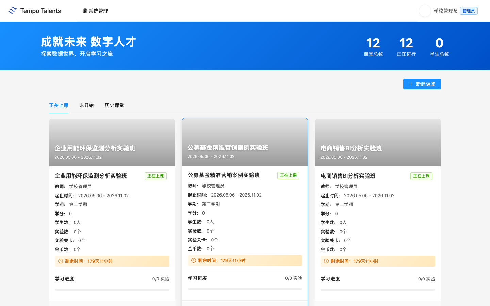

### 2.1 课堂详情页布局

课堂详情页左侧是功能菜单。老师本节课主要用“项目实训”，辅助查看“学情分析”和“作业列表”。当前 1696 课堂的“项目实训”数量为 1，对应 training 107；页面也保留“课程实践”“教学资源”“课程考核”“课堂云盘”等入口。

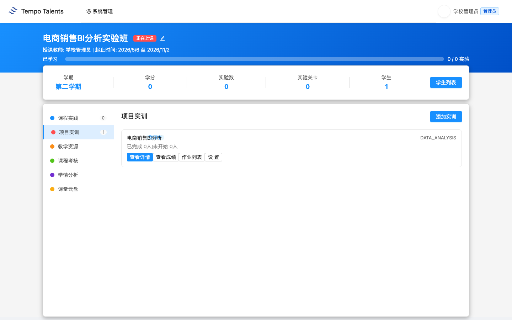

## 第 3 章 项目实训：电商销售BI分析

### 3.1 training 107 整体结构

老师进入课堂后，默认看到“项目实训”标签。卡片显示“电商销售BI分析 / DATA_ANALYSIS”。点击“查看详情”后，平台展示实训手册。学校环境核验显示 1 个章节：`视频和课件`，课堂组织以实训手册中的任务一到任务四为主线。

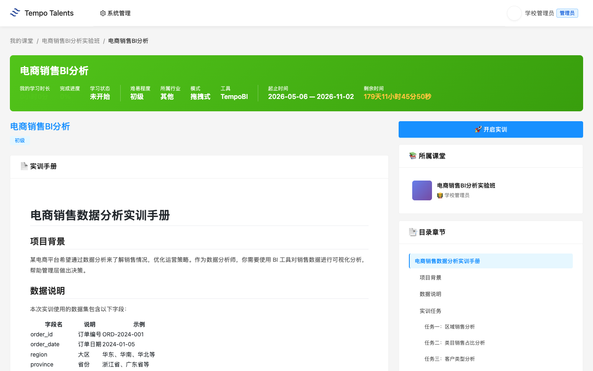

### 3.2 数据集说明

真实数据集为“数据集 1 - 电商销售BI分析”，文件路径为 `实训资源/05-电商销售BI分析/datasets/sales_data.sql`。数据表字段包括 `order_id`、`order_date`、`region`、`province`、`city`、`category`、`sub_category`、`product_name`、`sales_amount`、`quantity`、`profit`、`discount`、`customer_type`、`payment_method`。

老师讲数据时不要逐字段念表。建议先问学生三个业务问题：销售额最高的大区在哪里；哪个商品类目贡献最高；不同客户类型是否有不同消费特征。然后让学生把问题映射到字段，例如区域分析用 `region + sales_amount`，支付偏好用 `payment_method + order_id`。

### 3.3 90 分钟上课流程

| 时间 | 老师动作 | 学生动作 |
|---|---|---|
| 0-5 分钟 | 登录平台，打开 1696 课堂 | 准备浏览器 |
| 5-15 分钟 | 确认学生都进入课堂 | 登录并进入实验班 |
| 15-30 分钟 | 讲订单数据字段和业务问题 | 找到字段含义 |
| 30-60 分钟 | 演示区域销售柱状图和类目占比图 | 跟做图表 |
| 60-80 分钟 | 巡视学生独立练习 | 完成 4 个图表 |
| 80-90 分钟 | 总结分析结论，说明提交要求 | 保存作品并提交作业 |

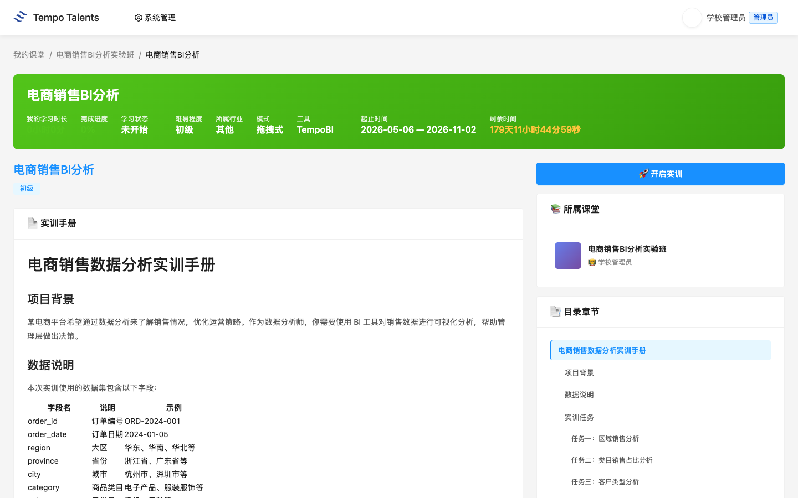

### 3.4 关键操作演示

老师演示时，先打开 BI 设计器，确认左侧数据集已加载，再把图表组件放到画布。演示建议只做一个完整例子：选择柱状图，把 `region` 作为分类字段，把 `sales_amount` 作为数值字段，聚合方式选择求和，然后让学生复用方法完成其他任务。

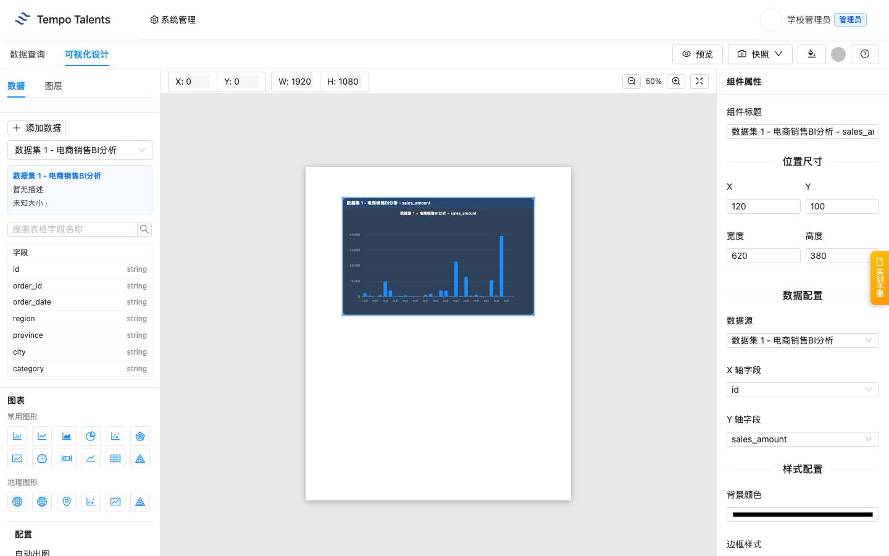

学生提交后，老师回到课堂项目卡片，点击“作业列表”。页面会显示学生姓名、提交状态、提交时间、作业快照和点评入口。当前 V1 本次交付核验中，`student_demo_bi107` 已提交，老师可以直接进入点评。

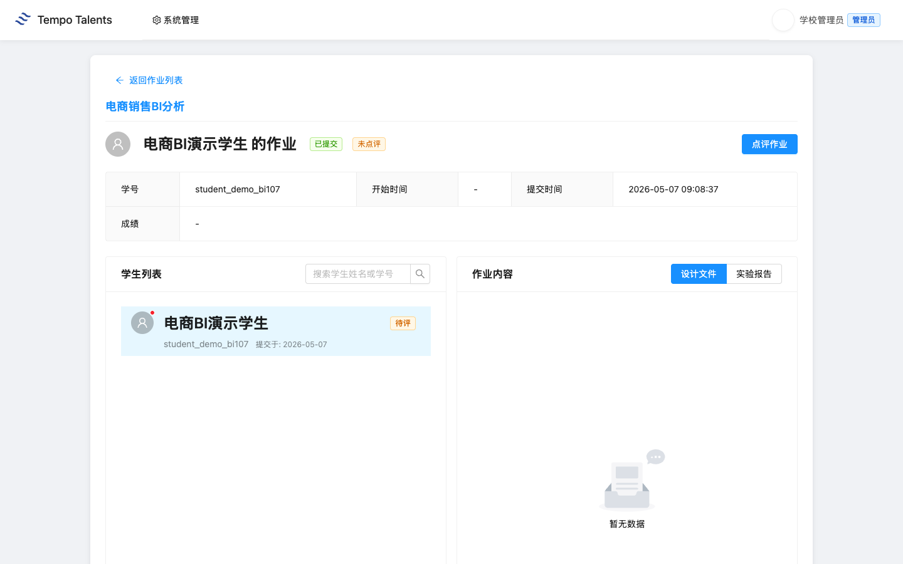

### 3.5 易错点提示

> **课堂提醒**：学生容易把 `quantity` 当作销售额。老师要强调销售额用 `sales_amount`，销量才用 `quantity`。

> **课堂提醒**：`discount` 是折扣率，不是优惠金额。分析促销效果时要和 `sales_amount`、`profit` 一起看。

> **课堂提醒**：学生提交前要先确认画布里至少有一个图表组件。老师巡视时重点看字段是否选对，而不是只看图表是否“好看”。

## 第 4 章 学生视角：学生看到什么

### 4.1 学生登录与进入实验班

学生使用学校交付清单中的演示学生账号登录。通用登录步骤见 [00-common.md](00-common.md)，本课只要求学生确认能看到“电商销售BI分析实验班”。学生端不会显示老师的系统管理入口，只显示自己的课堂和学习入口。

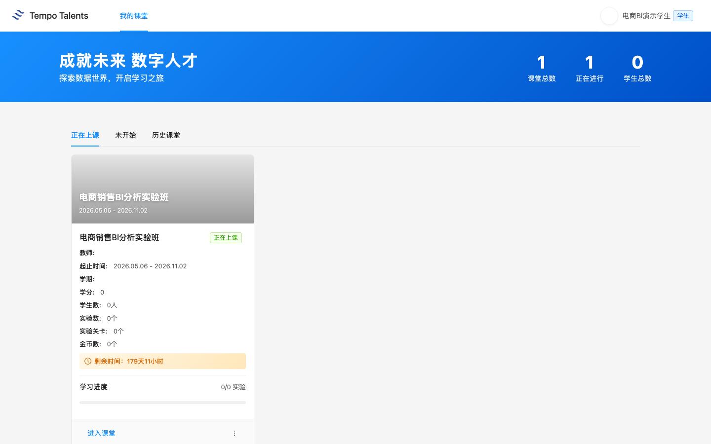

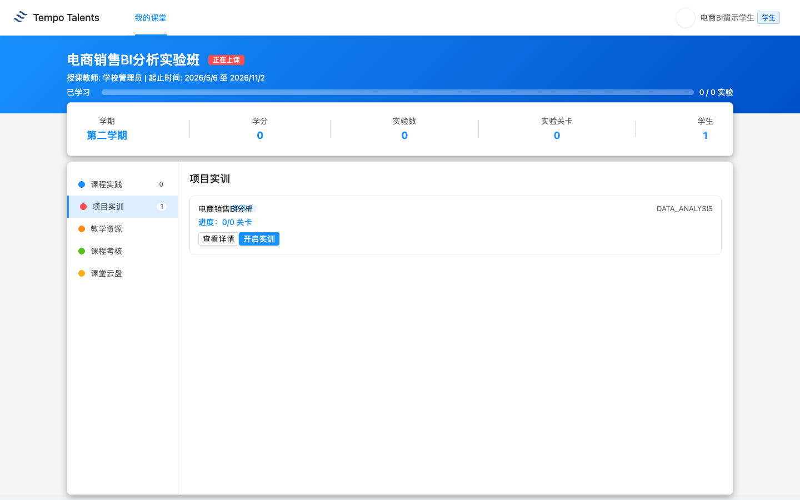

### 4.2 学生提交流程

学生点击“开启实训”后进入 BI 设计器。学校环境核验显示：数据集能加载，字段能展示，学生可以保存当前 BI 场景，并点击“提交作业”。提交成功后页面出现“作业提交成功”，平台已记录作业提交状态。

1. 点击“开启实训”。
2. 在 BI 设计器中完成图表。
3. 点击“保存”保存当前场景。
4. 点击“提交作业”完成课堂提交。

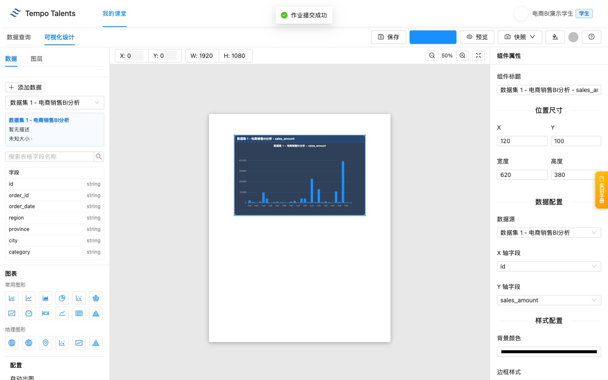

### 4.3 学生求助路径

学生遇到问题时，老师先判断是账号问题、课堂加入问题，还是实训操作问题。账号问题由信息中心处理；课堂加入问题由学校管理员检查学生是否在 classroom 1696；图表不会做时，老师回到字段和业务问题，帮助学生重新选择分类字段和数值字段。

## 第 5 章 教学管理

### 5.1 班级学生进度查看

老师进入“学情分析”可以看到学情总览、必修课程统计、拓展课程统计。本次交付核验中，演示学生提交后由老师评分 88 分，学情总览显示平均成绩排名，学生平均成绩为 88.0 分。

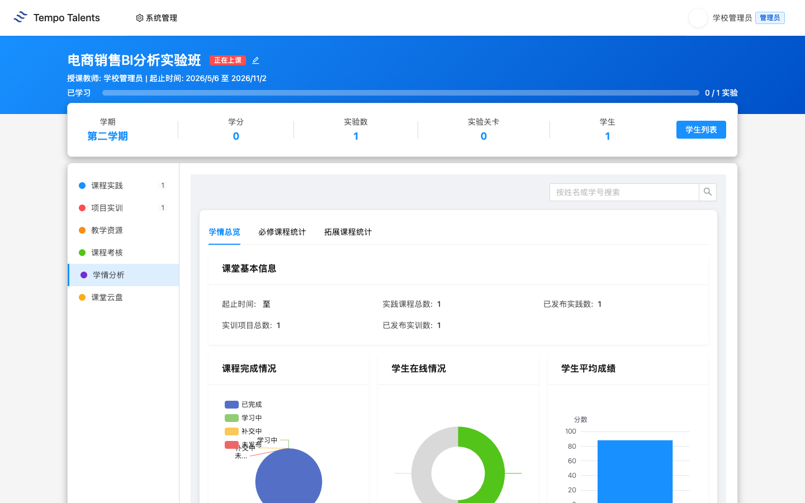

### 5.2 作业点评与评分

老师在作业详情页点击“点评作业”，输入分数和点评意见后确认。交付核验评分为 88 分，提交后页面显示“已点评”“成绩 88”和教师点评内容。

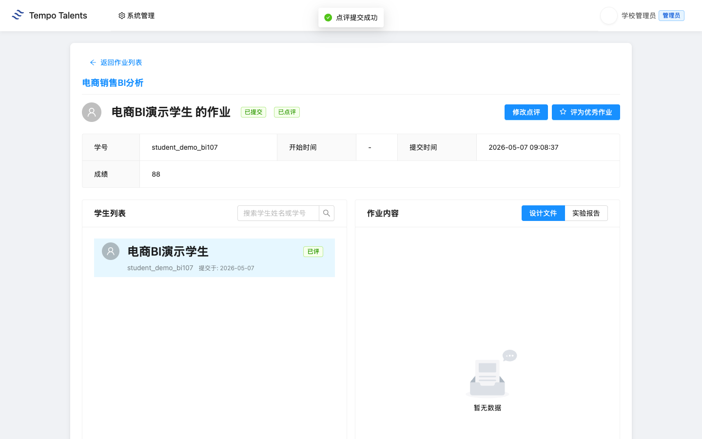

### 5.3 成绩统计与导出

在“必修课程统计”页，平台显示学生列表、在线状态、实践/实训完成数、平均分，并提供“导出所选”和“导出全部”。本次交付核验中，必修统计显示 `student_demo_bi107` 的实训完成数为 1，实训平均分和课程平均分均为 88.0；点击“导出全部”可下载 `学情统计_必修_*.xlsx`。

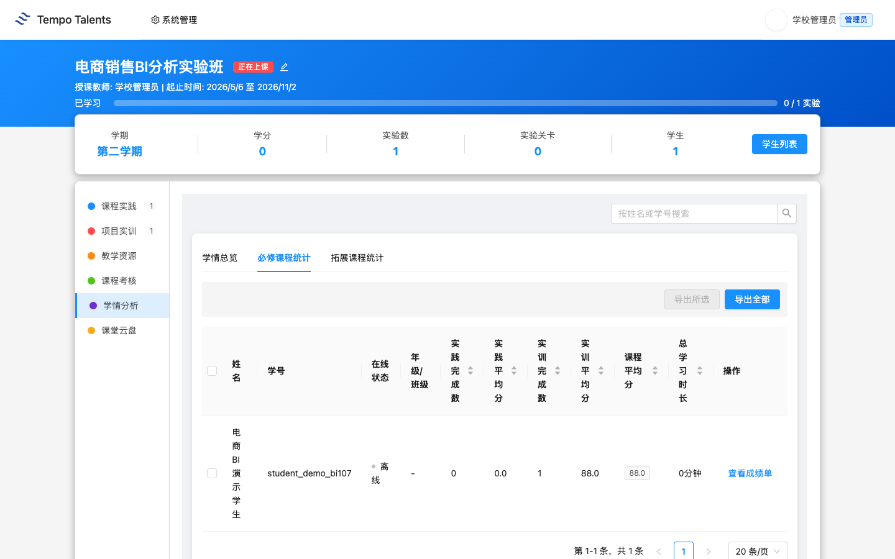

## 第 6 章 排错与求助

通用账号、网络、课堂加入、未授权、提交失败等排错流程见 [00-common.md](00-common.md)。本课老师重点关注以下课程特异问题：

| 问题 | 老师先做什么 | 后续处理 |
|---|---|---|
| 学生不会选字段 | 回到业务问题，先定分类字段和数值字段 | 用一个区域销售图做示范 |
| 老师看不到作业 | 确认学生是否已点击“提交作业” | 未提交时先让学生回 BI 设计器提交 |
| 学情统计未更新 | 确认老师已完成点评评分 | 刷新“必修课程统计”并核对实训完成数 |
| BI 图表字段不对 | 检查分类字段和数值字段是否选反 | 以 `region + sales_amount` 做标准示例 |

## 附录

### A. 教学要点提示

老师不要只讲工具按钮，要把每个图表和业务问题绑定：区域图回答“哪里卖得好”，类目图回答“卖什么”，客户类型图回答“谁在买”，支付方式图回答“怎么付”。课堂总结时让学生用一句业务语言解释图表，而不是只说“我做了柱状图”。

### B. 与课程标准的对应

本课对应数据分析基础、商业智能工具应用、数据可视化表达、业务问题分析四类能力。评价时建议同时看图表完整性、字段选择准确性、结论表达和作品整洁度。
