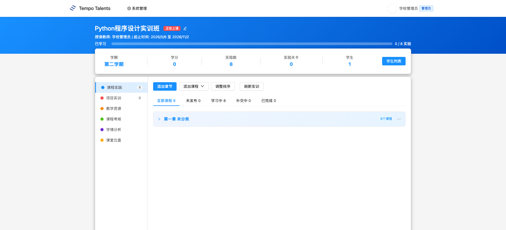
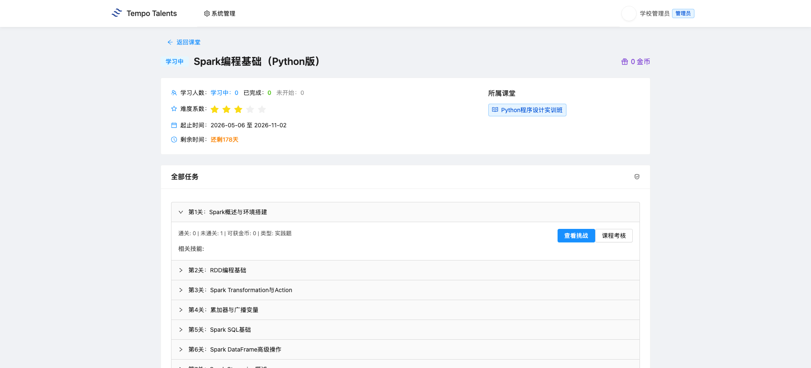
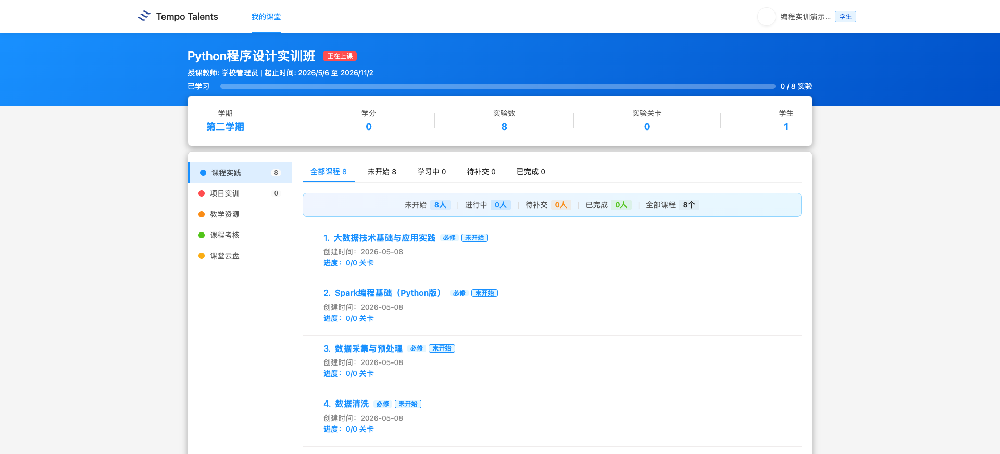
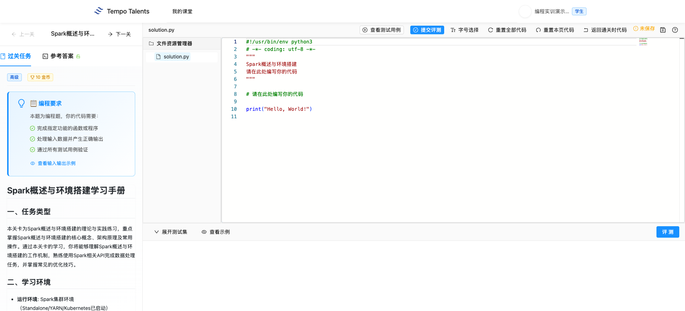
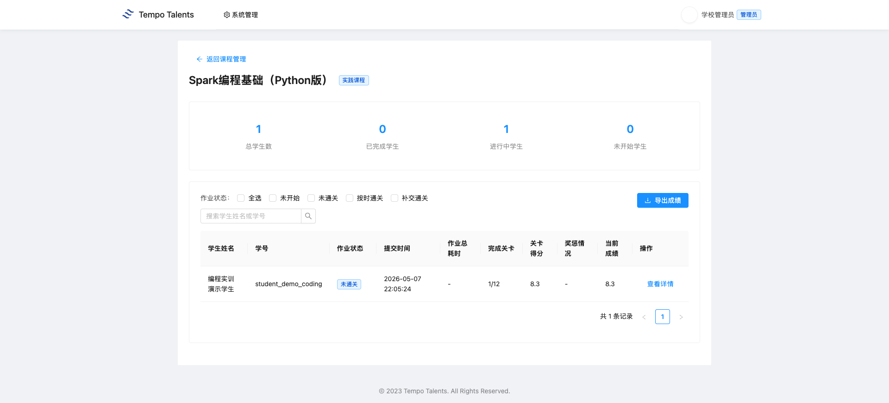
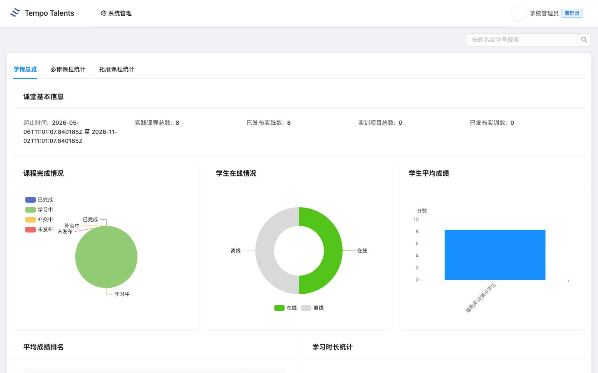
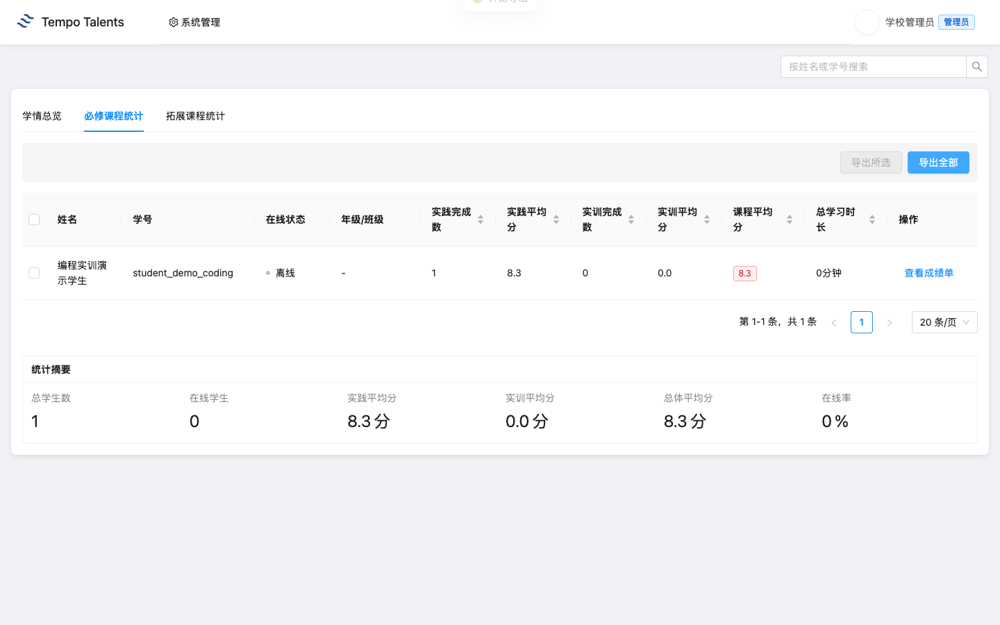

# Spark编程基础（Python版）- 教师上课指南 V11

适用课堂：Python程序设计实训班（classroom 1704）  
适用实训：Spark编程基础（Python版）（practice 3）  
教师账号：school_admin  
学生演示账号：student_demo_coding  
平台地址：学校内网 `http://<慧学内网IP-1>:3000`
学校前端版本：以学校 `/assets/` 目录下当前 `index-xxxx.js` 为准

通用登录、账号、运维和排错流程见 [../00-common.md](../00-common.md)。本文只保留“Spark编程基础（Python版）”课程特异内容。

## 快速导览

| 场景 | 老师先看 | 课堂动作 |
|---|---|---|
| 课前 5 分钟 | 顶部适用信息、账号和平台地址 | 登录教师账号，并用演示学生账号确认入口 |
| 开场讲解 | 第 1 章课程总览 | 用教学目标说明本课产出 |
| 课堂推进 | 第 3 章上课流程与关键演示 | 按 90 分钟节奏完成一次提交或作品 |
| 收尾核对 | 第 5 章教学管理 | 查看成绩、学情统计，并按需导出 Excel |
| 异常处理 | 第 6 章排错与求助 | 截图、记录课堂或任务 ID 后交给对应处理人 |

## 第 1 章 课程总览

### 1.1 课程定位与教学目标

这节课面向已经具备 Python 基础、准备理解分布式数据处理框架的学生。课程以 Spark 的核心概念、RDD 编程、DataFrame、Streaming、MLlib、GraphX 和综合项目为主线，让学生从“能解释 Spark 为什么用于大数据”过渡到“能完成基础代码评测任务”。

学校环境核验显示：practice 3 标题为“Spark编程基础（Python版）”，方向为“后端开发”，难度为 `intermediate`，共 12 个 task，164 条测试用例。课堂 1704 已挂载该实训，`student_demo_coding` 已加入课堂并完成 task 26 一次评测提交。

### 1.2 知识技能矩阵

| 模块 | 老师讲授重点 | 学生练习结果 |
|---|---|---|
| Spark 基础 | Spark 适用场景、Driver/Executor/RDD 基本概念 | 能说清 Spark 与单机 Python 的差异 |
| RDD 编程 | Transformation 与 Action 的执行关系 | 能读懂基础 RDD 操作题 |
| Spark SQL | DataFrame 与 SQL 风格数据处理 | 能完成字段筛选、聚合和排序 |
| 流式与机器学习 | Streaming、MLlib、GraphX 的使用边界 | 能理解后续大数据实训的技术路线 |
| 自动评测 | 提交代码、查看测试结果、修正错误 | 能完成平台代码评测闭环 |

### 1.3 学生交付物清单

本节课的学生交付物不是 BI 看板，而是平台代码评测提交记录。老师要求学生至少完成 task 26“Spark概述与环境搭建”，进阶班级可以继续完成 task 27 到 task 29。每个 task 以平台自动评测结果为准，老师在成绩页和学情页查看完成数、平均分和导出表格。

## 第 2 章 课堂入口

1. 老师登录学校内网平台。
2. 进入课堂列表，打开“Python程序设计实训班”（classroom 1704）。
3. 在课堂详情页确认“项目实训”或“课程实践”中能看到 Spark 相关实训入口。
4. 上课前用学生演示账号进入同一课堂，确认学生能看到任务入口。

## 第 3 章 项目实训：Spark编程基础

### 3.1 practice 3 整体结构

practice 3 一共 12 个 task，每个 task 的满分金币为 10。老师上课时不要一次讲完 12 个任务，建议先把 task 26 作为完整演示，再按学生基础决定是否继续推进 RDD、Transformation/Action 和 Spark SQL。

| task_id | 标题 | 建议用途 |
|---:|---|---|
| 26 | Spark概述与环境搭建 | 第一课演示与全班必做 |
| 27 | RDD编程基础 | 基础练习 |
| 28 | Spark Transformation与Action | 关键概念巩固 |
| 29 | 累加器与广播变量 | 进阶概念 |
| 30 | Spark SQL基础 | DataFrame/SQL 入门 |
| 31 | Spark DataFrame高级操作 | 数据处理进阶 |
| 32 | Spark Streaming概述 | 流式处理入门 |
| 33 | Structured Streaming | 流式处理进阶 |
| 34 | Spark MLlib基础 | 机器学习组件 |
| 35 | Spark GraphX图计算 | 图计算概念 |
| 36 | Spark性能优化 | 性能调优 |
| 37 | Spark电商数据处理项目 | 综合练习 |

### 3.2 90 分钟上课流程

| 时间 | 老师动作 | 学生动作 |
|---|---|---|
| 0-10 分钟 | 打开 1704 课堂，说明 Spark 课程目标 | 登录并进入课堂 |
| 10-25 分钟 | 讲 Spark 基础概念和 task 26 要求 | 阅读任务说明 |
| 25-45 分钟 | 演示代码编辑、运行和提交 | 跟做第一次提交 |
| 45-65 分钟 | 解释评测失败时如何定位错误 | 修改代码并重新提交 |
| 65-80 分钟 | 巡视学生独立完成 task 26 | 完成通过评测 |
| 80-90 分钟 | 打开成绩页和学情页总结完成情况 | 查看个人结果 |

### 3.3 关键操作演示

老师演示时，先从课堂进入 practice 3，再打开 task 26。重点不是让学生背 Spark API，而是让学生理解平台评测闭环：阅读题目、修改代码、提交评测、查看测试结果，再根据错误信息修正。

学生提交后，平台会记录评测结果。本次交付核验中，`student_demo_coding` 对 task 26 的提交状态为 `pass`，通过 15/15 个测试，成绩页折算为 8.3 分，因为该课堂挂载了 8 个实践课程，当前学生只完成了其中 1 个。

## 第 4 章 学生视角

### 4.1 学生进入课堂

学生使用 `student_demo_coding` 登录后，进入“Python程序设计实训班”。学生视角只关注自己的课程入口和任务完成，不显示老师的班级管理菜单。

### 4.2 学生提交代码

学生打开 task 26 后，在代码编辑区填写或修改答案，然后点击提交评测。老师提醒学生：评测通过不是终点，还要能解释代码为什么通过；评测失败时先看失败用例和错误提示，不要盲目刷新页面。

## 第 5 章 教学管理

### 5.1 成绩页查看

老师回到课堂后，进入课程成绩页，可以看到 `student_demo_coding` 的完成情况。交付核验结果显示 task 26 已提交并通过，自动成绩折算为 8.3 分。这个页面适合课堂结束前快速确认谁已经完成基础任务。

### 5.2 学情分析

学情分析页用于看班级整体进度。当前 1704 课堂真值为：实践课程总数 8、已发布实践数 8；必修课程统计中 `student_demo_coding` 的实践完成数为 1、实践平均分为 8.3、课程平均分为 8.3。

### 5.3 Excel 导出

老师在“必修课程统计”页点击“导出全部”，平台会下载学情统计 Excel。交付核验导出的 xlsx 中包含 `编程实训演示学生`，实践完成数为 1，实践平均分和总平均分均为 8.3。

## 第 6 章 排错与求助

| 问题 | 老师先检查 | 处理方向 |
|---|---|---|
| 学生看不到 1704 课堂 | 学生是否使用 `student_demo_coding` 或学校分配账号登录 | 信息中心检查学生是否已加入课堂 |
| 任务打不开 | 课堂详情页是否能看到 Spark 实训入口 | 截图给信息中心和 慧学 团队 |
| 提交后没有成绩 | 是否点了提交评测，页面是否显示测试结果 | 提供 task_id、学生账号和提交时间 |
| 学情统计为 0 | 成绩页是否已有提交记录 | 交由平台运维检查学习统计接口 |
| Excel 下载失败 | 浏览器是否拦截下载 | 换浏览器后仍失败则提供页面截图 |

本指南只覆盖 V11 标杆的 Spark 首份编程实训。V12 到 V17 复用本流程，但每份仍需基于学校真课堂、真学生提交和真截图重新生产。
