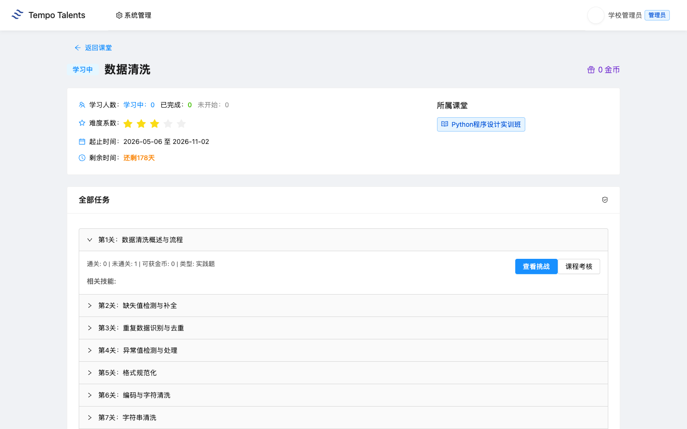
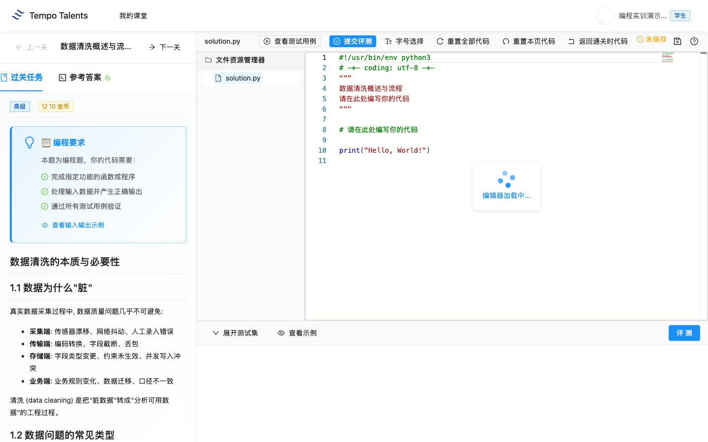
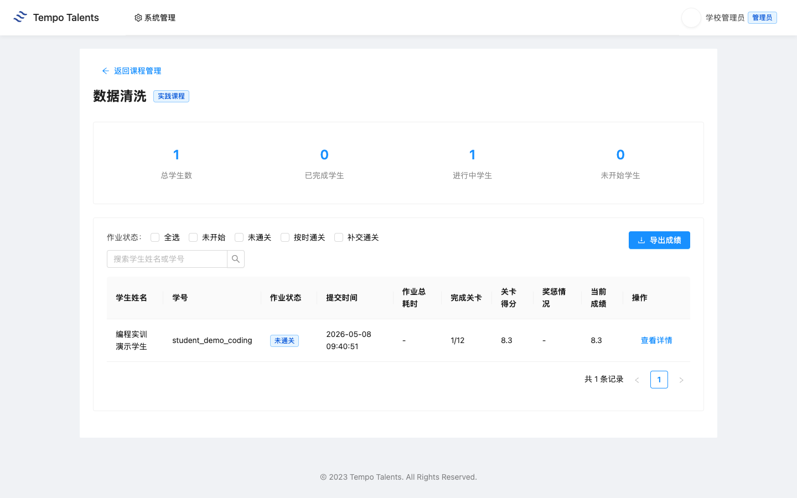
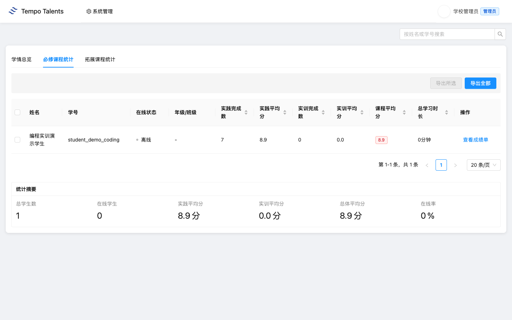

# 数据清洗 - 教师上课指南 V13

适用课堂：Python程序设计实训班（classroom 1704）  
适用实训：数据清洗（practice 5）  
课堂课程：classroom_course 27  
教师账号：school_admin  
学生演示账号：student_demo_coding  
平台地址：学校内网 `http://192.168.109.42:3000`
学校前端版本：以学校 `/assets/` 目录下当前 `index-xxxx.js` 为准

通用登录、账号、运维和排错流程见 [../00-common.md](../00-common.md)。本文只保留“数据清洗”课程特异内容。

## 快速导览

| 场景 | 老师先看 | 课堂动作 |
|---|---|---|
| 课前 5 分钟 | 顶部适用信息、账号和平台地址 | 登录教师账号，并用演示学生账号确认入口 |
| 开场讲解 | 第 1 章课程总览 | 用教学目标说明本课产出 |
| 课堂推进 | 第 3 章上课流程与关键演示 | 按 90 分钟节奏完成一次提交或作品 |
| 收尾核对 | 第 5 章教学管理 | 查看成绩、学情统计，并按需导出 Excel |
| 异常处理 | 第 6 章排错与求助 | 截图、记录课堂或任务 ID 后交给对应处理人 |

## 第 1 章 课程总览

### 1.1 课程定位与教学目标

这节课属于后端开发方向的编程实训课，面向已经进入平台代码评测环节的学生。课程重点是：缺失值、重复值、异常值、格式规范化和清洗质量评估。老师上课时要把“概念理解”和“可评测函数实现”连起来，避免只讲名词或只让学生复制代码。

学校环境核验显示：practice 5 标题为“数据清洗”，方向为“后端开发”，难度为 `intermediate`，共有 12 个 task、297 条测试用例。`student_demo_coding` 已在学校环境完成首关 task 118“数据清洗概述与流程”的一次通过提交。

### 1.2 知识技能矩阵

| 模块 | 老师讲授重点 | 学生练习结果 |
|---|---|---|
| 课程背景 | 缺失值、重复值、异常值、格式规范化和清洗质量评估 | 能说清本课解决什么问题 |
| 首关任务 | task 118：数据清洗概述与流程 | 能完成一次函数评测提交 |
| 代码质量 | 类型检查、边界处理、异常抛出 | 能通过隐藏和公开测试 |
| 学习管理 | 成绩页、学情页、导出表格 | 能用数据判断课堂进度 |

## 第 2 章 课堂入口

1. 老师登录学校内网平台。
2. 进入“Python程序设计实训班”（classroom 1704）。
3. 打开 数据清洗 的课程详情。
4. 确认学生账号 `student_demo_coding` 能进入同一任务页。

## 第 3 章 项目实训：数据清洗

### 3.1 整体结构

本 practice 共 12 个 task。首课建议只把 task 118 作为完整闭环演示，后续 task 按班级基础推进。课堂上先讲题目背景，再讲函数输入输出，最后让学生提交评测。

| 指标 | 学校真值 |
|---|---|
| practice_id | 5 |
| classroom_course_id | 27 |
| task 总数 | 12 |
| 测试用例总数 | 297 |
| 首个核验 task | 118 - 数据清洗概述与流程 |

### 3.2 90 分钟上课流程

| 时间 | 老师动作 | 学生动作 |
|---|---|---|
| 0-10 分钟 | 打开课堂和课程详情，说明本课目标 | 登录并进入 1704 课堂 |
| 10-25 分钟 | 讲解首关业务背景和函数签名 | 阅读 task 118 说明 |
| 25-45 分钟 | 演示一次代码提交和评测结果 | 跟做首关 |
| 45-65 分钟 | 讲解失败用例和边界处理 | 修改代码并重新提交 |
| 65-80 分钟 | 巡视学生完成情况 | 独立完成首关 |
| 80-90 分钟 | 打开成绩页和学情页总结 | 查看个人评测状态 |

### 3.3 首关教学提示

让学生把脏数据问题分类，再用函数完成质量状态判断、清洗优先级和 drop/fill 决策。 老师要强调：评测通过依赖输入类型、边界条件和异常处理，不能只覆盖正常样例。

## 第 4 章 学生视角

学生进入 task 118 后，页面显示“已通关”，说明学校真实评测链路已记录该学生的通过状态。老师可以让学生先看题目说明，再看自己提交后的状态和测试结果。

## 第 5 章 教学管理

### 5.1 成绩页查看

老师进入 `数据清洗` 的成绩页，可以看到 `student_demo_coding` 已完成 1/12，当前成绩为 8.3 分。该分数是课堂内按完成关卡数折算的阶段成绩，不等同于单个 task 的金币满分。

### 5.2 学情分析

1704 课堂必修课程统计在 6 份首关提交后显示：`student_demo_coding` 实践完成数为 7，实践平均分为 8.9，课程平均分为 8.9。这个页面适合老师做课堂收尾和进度核对。

### 5.3 Excel 导出

老师在“必修课程统计”页点击“导出全部”，平台返回 xlsx。交付核验导出文件中 `student_demo_coding` 行包含实践完成数 7、实践平均分 8.9、总平均分 8.9。

## 第 6 章 排错与求助

| 问题 | 老师先检查 | 处理方向 |
|---|---|---|
| 学生看不到任务 | 是否进入 classroom 1704 和 practice 5 | 信息中心检查课堂学生关系 |
| 提交后不显示通过 | 查看页面测试结果和错误用例 | 让学生补类型检查、边界条件或异常处理 |
| 成绩页没有记录 | 是否已点击提交评测 | 提供 task_id 118 和学生账号 |
| 学情统计不更新 | 成绩页是否已有提交记录 | 交由平台运维检查学习统计接口 |
| Excel 下载失败 | 浏览器是否拦截下载 | 换浏览器后仍失败则截图反馈 |
