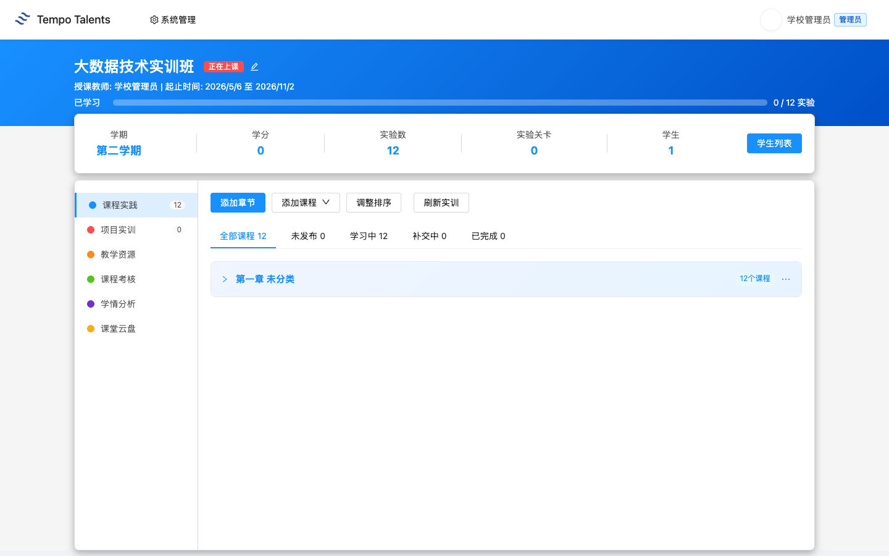
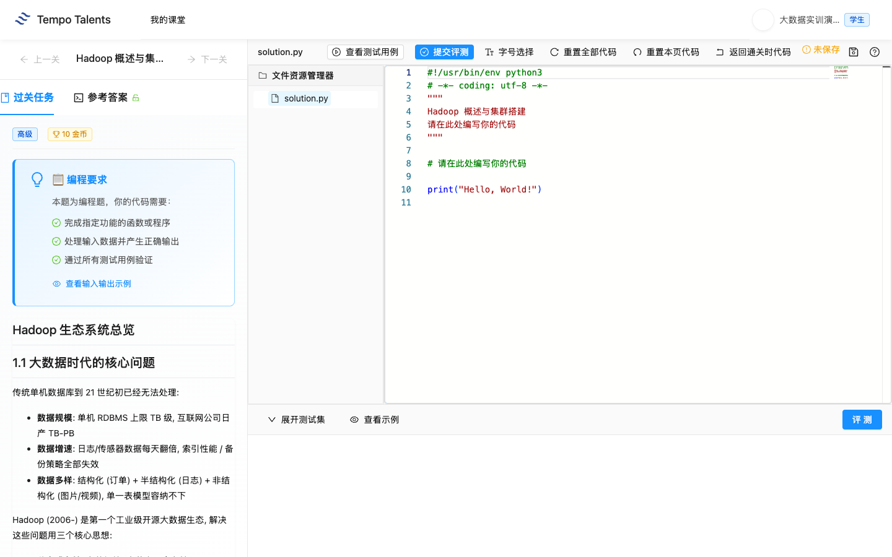
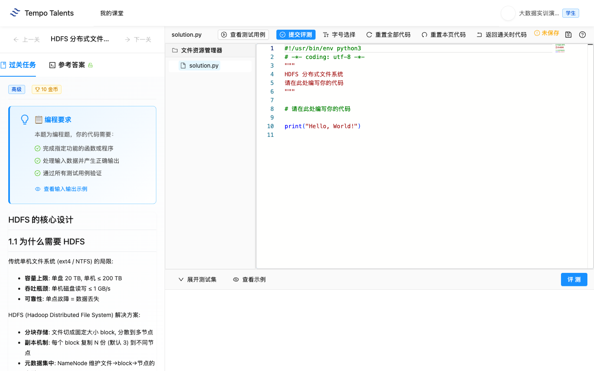
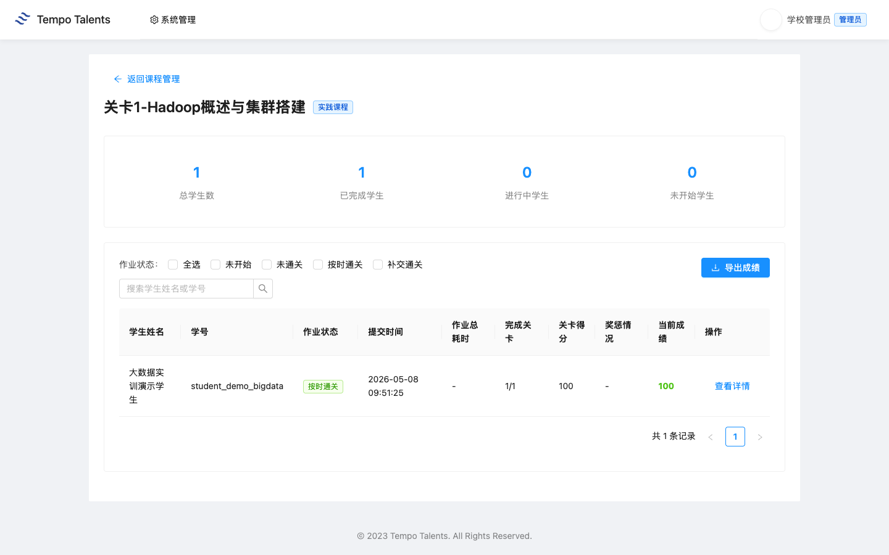
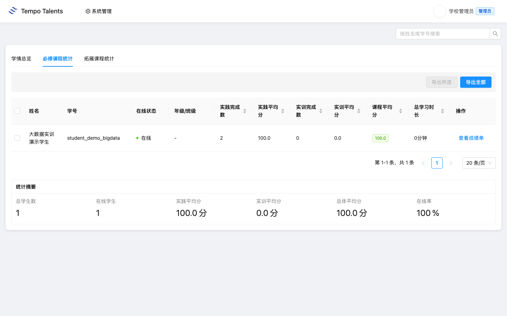

# 大数据综合实训 - 教师上课指南 V18

适用课堂：大数据技术实训班（classroom 1705）  
适用范围：practice 12-23 合并综合指南  
教师账号：school_admin  
学生演示账号：student_demo_bigdata  
平台地址：学校内网 `http://<慧学内网IP-1>:3000`
学校前端版本：以学校 `/assets/` 目录下当前 `index-xxxx.js` 为准

通用登录、账号、运维和排错流程见 [../00-common.md](../00-common.md)。本文只保留“大数据综合实训”课程特异内容。

## 快速导览

| 场景 | 老师先看 | 课堂动作 |
|---|---|---|
| 课前 5 分钟 | 顶部适用信息、账号和平台地址 | 登录教师账号，并用演示学生账号确认入口 |
| 开场讲解 | 第 1 章课程总览 | 用教学目标说明本课产出 |
| 课堂推进 | 第 3 章上课流程与关键演示 | 按 90 分钟节奏完成一次提交或作品 |
| 收尾核对 | 第 5 章教学管理 | 查看成绩、学情统计，并按需导出 Excel |
| 异常处理 | 第 6 章排错与求助 | 截图、记录课堂或任务 ID 后交给对应处理人 |

## 第 1 章 课程总览

### 1.1 课程定位与教学目标

这份指南覆盖 1705 大数据技术实训班内 practice 12 到 practice 23 的 12 个关卡。它不是 12 份独立教师指南，而是一份综合课指南，帮助老师按 Hadoop、HDFS、MapReduce、YARN、Hive、HBase、Sqoop、Kafka 和综合项目的顺序组织教学。

学校环境核验显示：classroom 1705 已挂载 12 个大数据 practice，每个 practice 1 个 task，共 12 个 task。本次交付核验中 `student_demo_bigdata` 完成了 task 130 和 task 131，两关均通过；老师成绩页和学情统计已显示该学生完成数 2、平均分 100.0。

### 1.2 知识技能矩阵

| 模块 | 老师讲授重点 | 学生练习结果 |
|---|---|---|
| Hadoop/HDFS | 组件角色、集群容量、Block、副本和元数据 | 能完成 Hadoop 与 HDFS 基础函数评测 |
| MapReduce/YARN | 计算流程、资源调度和作业运行 | 能解释批处理任务如何被调度执行 |
| Hive/HBase | 数仓建模、SQL 查询、NoSQL 读写 | 能区分分析型和在线型存储场景 |
| Sqoop/Kafka | 离线迁移与实时流处理 | 能说明批流数据链路差异 |
| 综合项目 | 串联采集、存储、计算、查询和流处理 | 能画出端到端大数据处理链路 |

## 第 2 章 课堂入口

1. 老师登录平台后进入“大数据技术实训班”（classroom 1705）。
2. 在课堂详情页确认 12 个大数据关卡均可见。
3. 首次上课建议只演示关卡 1 和关卡 2，后续按章节推进。
4. 学生使用 `student_demo_bigdata` 或学校分配账号进入同一课堂。

## 第 3 章 12 个关卡教学安排

| practice_id | 关卡 | task_id | 教学重点 |
|---:|---|---:|---|
| 12 | 关卡1-Hadoop概述与集群搭建 | 130 | Hadoop 组件角色、集群容量估算、安全模式和默认端口 |
| 13 | 关卡2-HDFS分布式文件系统 | 131 | Block 数量、副本存储、Block Size 合理性和 NameNode 元数据 |
| 14 | 关卡3-HDFS操作与JavaAPI | 132 | HDFS 命令、Java API 和块调度理解 |
| 15 | 关卡4-MapReduce分布式计算原理 | 133 | Map、Shuffle、Reduce 的执行流程 |
| 16 | 关卡5-MapReduce编程实战 | 134 | Mapper/Reducer 编程和作业提交 |
| 17 | 关卡6-YARN资源管理与调度 | 135 | ResourceManager、NodeManager、队列和资源分配 |
| 18 | 关卡7-Hive数据仓库基础 | 136 | 表、分区、元数据和仓库建模 |
| 19 | 关卡8-HiveQL查询与优化 | 137 | 查询语句、聚合、Join 和基础优化 |
| 20 | 关卡9-HBase NoSQL数据库 | 138 | RowKey、列族、读写路径和适用场景 |
| 21 | 关卡10-Sqoop数据迁移工具 | 139 | 关系库与 Hadoop 之间的数据迁移 |
| 22 | 关卡11-Kafka流数据平台 | 140 | Topic、Partition、Producer/Consumer 和流式数据 |
| 23 | 关卡12-大数据综合项目实战 | 141 | 把采集、存储、计算、数仓和流处理串成项目 |

### 3.1 Hadoop 与 HDFS 起步

关卡 1 和关卡 2 是本综合实训的入口。老师先讲 Hadoop 生态的组件角色，再讲 HDFS 为什么使用 Block、副本和 NameNode 元数据。学生不需要一开始就部署完整集群，先通过函数评测把容量估算、端口、Block 数和副本存储规则理解清楚。

### 3.2 MapReduce 与 YARN

关卡 4 到关卡 6 适合放在第二次课。老师要把“数据切片 - Map - Shuffle - Reduce - 输出”讲成一条流水线，再解释 YARN 如何给任务分配资源。学生完成函数题时，重点看输入输出和边界，而不是背诵框架名词。

### 3.3 Hive、HBase、Sqoop、Kafka

关卡 7 到关卡 11 是大数据平台应用层。老师建议用一张链路图串起来：业务数据先进入 HDFS，再进入 Hive 做分析；需要低延迟读写时使用 HBase；关系库离线迁移用 Sqoop；实时事件流用 Kafka。

### 3.4 综合项目

关卡 12 用于收尾。老师不要求学生一次性完成所有工程细节，而是要求学生能说清数据从来源进入平台、经过存储和计算、最后支持查询或流式处理的完整过程。

## 第 4 章 学生视角

学生进入关卡后，页面显示“已通关”代表学校真实评测已经记录通过结果。本次交付核验只跑关卡 1 和关卡 2，符合“综合指南只抽查 1-2 个关卡”的范围，不把 12 个关卡全部跑完。

## 第 5 章 教学管理

### 5.1 成绩页查看

老师进入关卡 1 的成绩页，可以看到 `student_demo_bigdata` 已完成 1/1，当前成绩 100.0。关卡 2 同样已完成 1/1。

### 5.2 学情分析

1705 课堂必修课程统计显示：`student_demo_bigdata` 实践完成数为 2，实践平均分为 100.0，课程平均分为 100.0。老师可用该页判断班级整体推进到哪个关卡。

### 5.3 Excel 导出

老师在“必修课程统计”页点击“导出全部”，平台返回 xlsx。交付核验导出文件中 `student_demo_bigdata` 行包含实践完成数 2、实践平均分 100.0、总平均分 100.0。

## 第 6 章 排错与求助

| 问题 | 老师先检查 | 处理方向 |
|---|---|---|
| 学生看不到 1705 课堂 | 是否使用大数据班学生账号 | 信息中心检查学生是否已加入课堂 |
| 12 个关卡缺失 | 课堂详情页是否显示大数据 practice | 平台运维检查课堂课程配置 |
| 评测失败 | 看失败用例和函数输入输出 | 引导学生补类型检查和边界条件 |
| 学情统计不更新 | 成绩页是否已有通过记录 | 检查 learning analytics 聚合接口 |
| Excel 下载失败 | 浏览器是否拦截下载 | 换浏览器后仍失败则截图反馈 |

## 附录

本指南演示学生 `student_demo_bigdata` 完成关卡 1+2 作为提交链路样本；学校老师可视真教学需要要求学生完成更多关卡。
