# 企业用能环保监测分析 - 教师上课指南 V2

适用课堂：企业用能环保监测分析实验班（classroom 1694）  
适用实训：企业用能环保监测分析（training 103）  
教师账号：school_admin  
学生演示账号：student_demo_bi107  
平台地址：学校内网 `http://192.168.109.42:3000`
学校前端版本：以学校 `/assets/` 目录下当前 `index-xxxx.js` 为准

通用登录、账号、运维和排错流程见 [00-common.md](00-common.md)。本文只保留“企业用能环保监测分析”课程特异内容。

## 快速导览

| 场景 | 老师先看 | 课堂动作 |
|---|---|---|
| 课前 5 分钟 | 顶部适用信息、账号和平台地址 | 登录教师账号，并用演示学生账号确认入口 |
| 开场讲解 | 第 1 章课程总览 | 用教学目标说明本课产出 |
| 课堂推进 | 第 3 章上课流程与关键演示 | 按 90 分钟节奏完成一次提交或作品 |
| 收尾核对 | 第 5 章教学管理 | 查看成绩、学情统计，并按需导出 Excel |
| 异常处理 | 第 6 章排错与求助 | 截图、记录课堂或任务 ID 后交给对应处理人 |

## 第 1 章 课程总览

### 1.1 课程定位与教学目标

这节课面向已经完成基础 BI 操作训练、准备进入能源环保业务场景的老师。课程使用制造企业用能与环保监测数据，带学生完成能耗趋势、碳排放核算、污染物监测和节能建议分析，让学生理解“监测指标 - 时间趋势 - 异常识别 - 管理建议”的完整路径。

学生学完后应能做三件事：识别工业能耗监测数据中的关键字段；在 BI 设计器中用时间序列图表达用电、用水、碳排放和污染物变化；根据 PM2.5、SO2、碳排放和用电量提出简短的节能减排建议。学校环境核验显示 classroom 1694 已挂载 training 103，学生演示账号已加入课堂并完成一次提交，老师已评分 86 分。

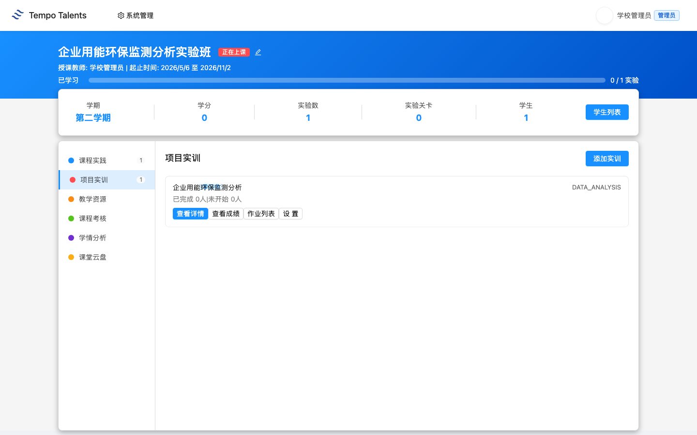

### 1.2 知识技能矩阵

| 模块 | 老师讲授重点 | 学生练习结果 |
|---|---|---|
| 数据理解 | 时间戳、用电量、用水量、碳排放、污染物浓度 | 能说清监测字段含义 |
| 趋势分析 | 按小时、日、周观察能耗波动 | 能做时间序列图 |
| 环保监测 | PM2.5、SO2 浓度与参考阈值 | 能识别异常或高值时段 |
| 管理建议 | 能效诊断、排放监控、成本控制 | 能写 3 条节能减排建议 |

### 1.3 学生交付物清单

本节课的学生交付物是一份企业用能环保 BI 看板：至少包含用电量时间趋势图、碳排放统计图、PM2.5 或 SO2 监测图、用水量对比图，并附 3 到 5 句业务结论。学生在 BI 设计器内完成作品后点击“提交作业”，老师可在课堂作业列表中查看提交记录、评分并写点评。

## 第 2 章 课堂入口

1. 进入“我的课堂”或直接访问 `/#/classroom`。
2. 在课堂列表中找到“企业用能环保监测分析实验班”。
3. 点击课堂卡片进入详情页。首次加载详情页会拉取 BI 设计器相关资源，页面可能需要等待十几秒。

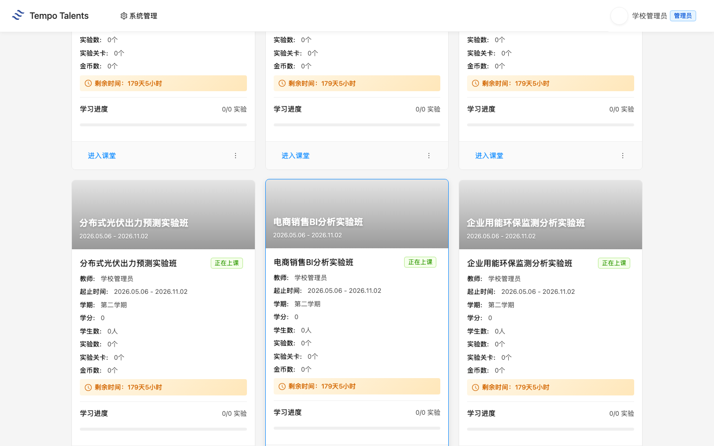

### 2.1 课堂详情页布局

课堂详情页左侧是功能菜单。老师本节课主要使用“项目实训”，辅助查看“学情分析”和“作业列表”。当前 1694 课堂的“项目实训”数量为 1，对应 training 103；页面也保留“课程实践”“教学资源”“课程考核”“课堂云盘”等入口。

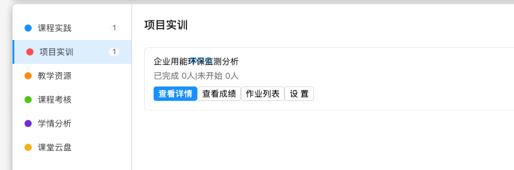

## 第 3 章 项目实训：企业用能环保监测分析

### 3.1 training 103 整体结构

老师进入课堂后，默认看到“项目实训”标签。卡片显示“企业用能环保监测分析 / DATA_ANALYSIS”。点击“查看详情”后，平台展示实训手册。学校环境核验显示 1 个章节：`企业用能环保监测分析`，课堂组织以实训手册中的任务背景、任务目标、数据说明和分析产出为主线。

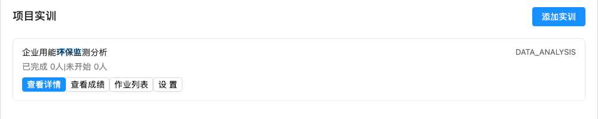

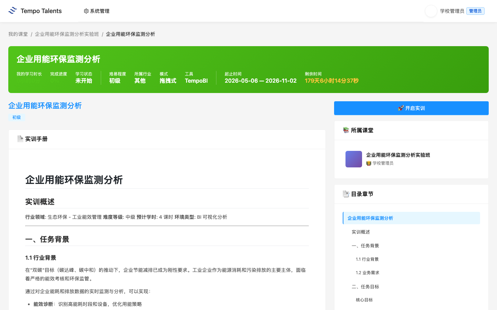

### 3.2 数据集说明

真实数据集有 2 个：`energy_monitoring.csv` 和 `energy_monitoring_hourly.csv`。平台 BI 设计器当前加载到的字段包括 `timestamp`、`power_kwh`、`carbon_emission_kg`、`water_consumption_m3`、`pm25`、`so2_ppm`；第二个小时级数据集还包含 `production_units`。

老师讲数据时不要从字段表逐行念。建议先问学生四个业务问题：用电高峰出现在什么时候；碳排放是否随用电同步变化；PM2.5 或 SO2 有没有高值时段；企业应该优先从哪类指标切入节能。然后让学生把问题映射到字段，例如能耗趋势用 `timestamp + power_kwh`，碳排放核算用 `timestamp + carbon_emission_kg`，污染物监测用 `timestamp + pm25` 或 `so2_ppm`。

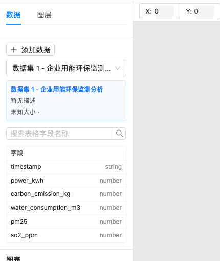

### 3.3 90 分钟上课流程

| 时间 | 老师动作 | 学生动作 |
|---|---|---|
| 0-5 分钟 | 登录平台，打开 1694 课堂 | 准备浏览器 |
| 5-15 分钟 | 确认学生都进入课堂 | 登录并进入实验班 |
| 15-30 分钟 | 讲双碳背景、监测字段和指标含义 | 找到字段含义 |
| 30-60 分钟 | 演示用电量趋势图和碳排放图 | 跟做图表 |
| 60-80 分钟 | 巡视学生独立练习 | 完成 4 个图表 |
| 80-90 分钟 | 总结异常时段和节能建议，说明提交要求 | 保存作品并提交作业 |

### 3.4 关键操作演示

老师演示时，先打开 BI 设计器，确认左侧数据集已加载，再使用平台自动出图生成第一张时间序列图。演示建议只做一个完整例子：把 `timestamp` 作为 X 轴字段，把 `power_kwh` 作为 Y 轴字段，让学生观察每天高峰与低谷，再让学生复用方法完成碳排放、用水量和污染物分析。

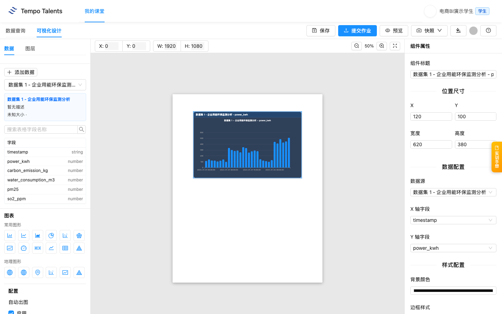

学生提交后，老师进入 training 103 的“作业列表”。页面会显示学生姓名、提交状态、提交时间、作业内容和点评入口。当前 V2 本次交付核验中，`student_demo_bi107` 已提交，老师已在作业页完成 86 分点评。

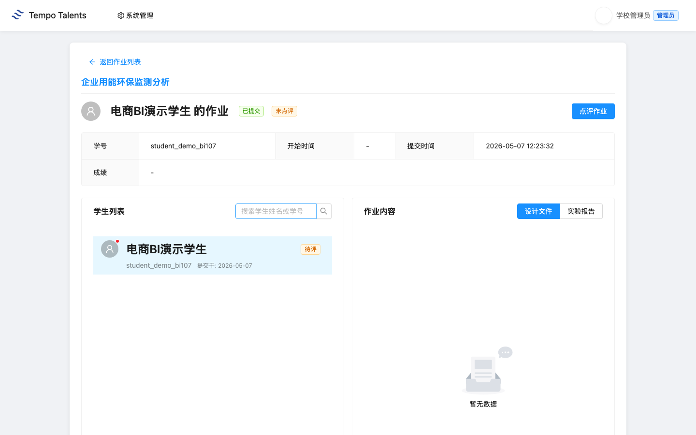

### 3.5 易错点提示

> **课堂提醒**：学生容易只看 `power_kwh`，忽略 `carbon_emission_kg`。老师要提醒学生能耗图和碳排放图应互相印证。

> **课堂提醒**：`pm25` 和 `so2_ppm` 是污染物浓度，不是能耗成本。分析污染物时要讲“是否高于参考阈值”，不要把它们和销售额类指标混用。

> **课堂提醒**：时间字段 `timestamp` 是本课的核心分类字段。学生如果把数值字段放到 X 轴，图表会变成难以解释的离散对比。

## 第 4 章 学生视角：学生看到什么

### 4.1 学生登录与进入实验班

学生使用学校交付清单中的演示学生账号登录。通用登录步骤见 [00-common.md](00-common.md)，本课只要求学生确认能看到“企业用能环保监测分析实验班”。学生端不会显示老师的系统管理入口，只显示自己的课堂和学习入口。

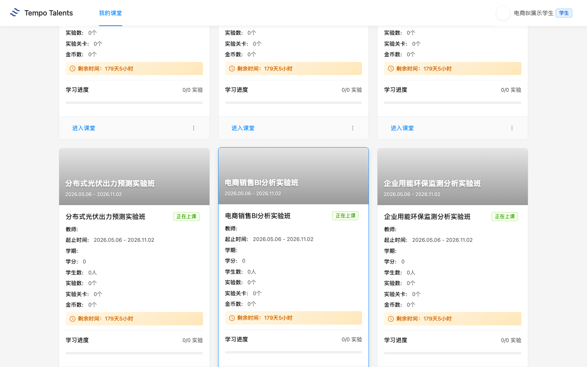

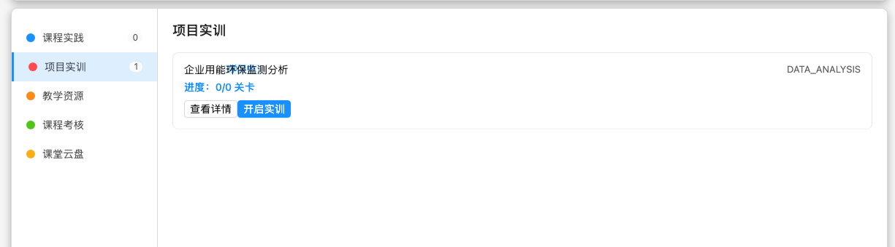

### 4.2 学生提交流程

学生点击“开启实训”后进入 BI 设计器。学校环境核验显示：数据集能加载，字段能展示，学生可以保存当前 BI 场景，并点击“提交作业”。提交接口返回 `code=0000`，平台已记录学生提交进度。

1. 点击“开启实训”。
2. 在 BI 设计器中完成图表。
3. 点击“保存”保存当前场景。
4. 点击“提交作业”完成课堂提交。

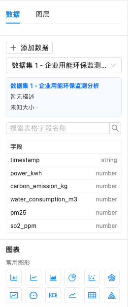

### 4.3 学生求助路径

学生遇到问题时，老师先判断是账号问题、课堂加入问题，还是实训操作问题。账号问题由信息中心处理；课堂加入问题由学校管理员检查学生是否在 classroom 1694；图表不会做时，老师回到字段和业务问题，帮助学生重新选择时间字段和数值字段。

## 第 5 章 教学管理

### 5.1 班级学生进度查看

老师进入“学情分析”可以看到学情总览、必修课程统计、拓展课程统计。本次交付核验中，演示学生提交后由老师评分 86 分，必修课程统计显示实训完成数为 1，实训平均分和课程平均分均为 86.0。

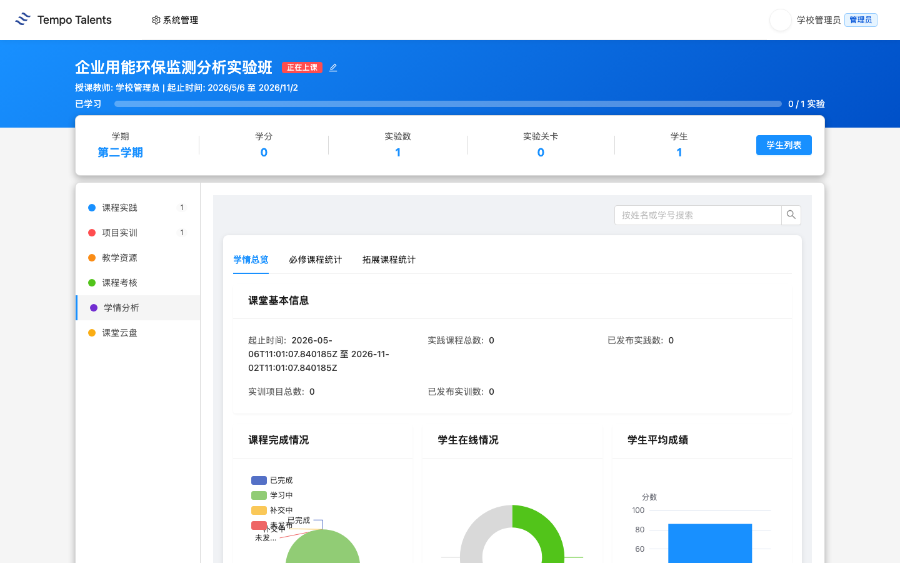

### 5.2 作业点评与评分

老师在作业详情页点击“点评作业”，输入分数和点评意见后确认。交付核验评分为 86 分，提交后页面显示“已点评”“成绩 86”和教师点评内容。

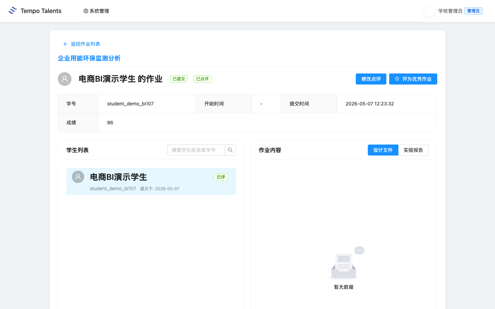

### 5.3 成绩统计与导出

在“必修课程统计”页，平台显示学生列表、在线状态、实践/实训完成数、平均分，并提供“导出所选”和“导出全部”。本次交付核验中，必修统计显示 `student_demo_bi107` 的实训完成数为 1，实训平均分和课程平均分均为 86.0。

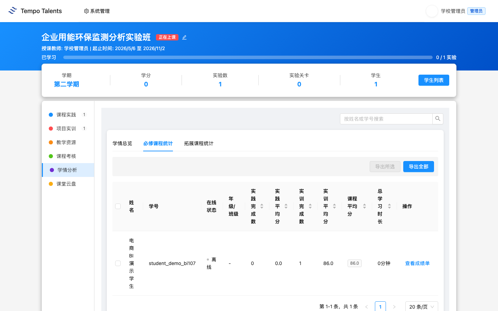

## 第 6 章 排错与求助

通用账号、网络、课堂加入、未授权、提交失败等排错流程见 [00-common.md](00-common.md)。本课老师重点关注以下课程特异问题：

| 问题 | 老师先做什么 | 后续处理 |
|---|---|---|
| 学生不知道分析什么 | 回到双碳和能耗监测背景，先定业务问题 | 从用电趋势图做第一个示范 |
| 学生字段选错 | 检查 X 轴是否为 `timestamp`，Y 轴是否为能耗或污染物字段 | 用 `timestamp + power_kwh` 做标准例子 |
| 老师看不到作业 | 确认学生是否已点击“提交作业” | 未提交时先让学生回 BI 设计器提交 |
| 学情统计未更新 | 确认老师已完成点评评分 | 刷新“必修课程统计”并核对实训完成数 |

## 附录

### A. 教学要点提示

老师不要只讲工具按钮，要把每个图表和企业管理问题绑定：用电趋势回答“什么时候耗能高”，碳排放回答“排放压力在哪里”，污染物图回答“有没有异常风险”，用水图回答“资源消耗是否同步波动”。课堂总结时让学生用一句管理语言解释图表，而不是只说“我做了柱状图”。

### B. 与课程标准的对应

本课对应数据分析基础、商业智能工具应用、能源环保数据理解、业务问题分析四类能力。评价时建议同时看图表完整性、字段选择准确性、结论表达和节能建议可操作性。
