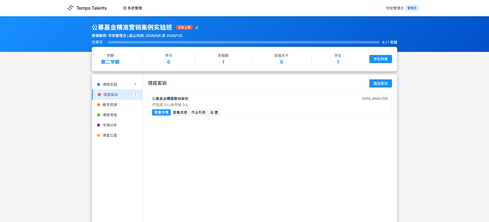
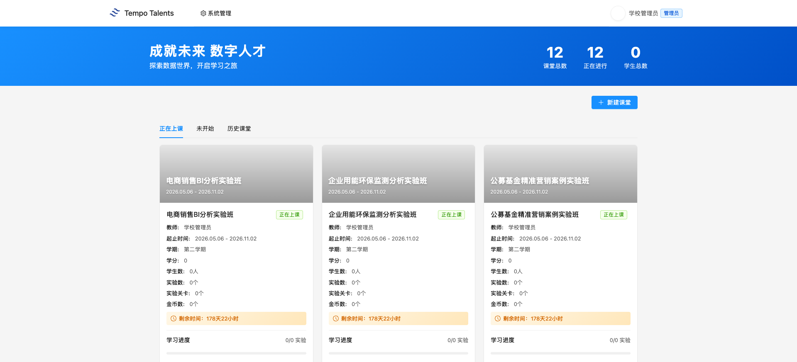
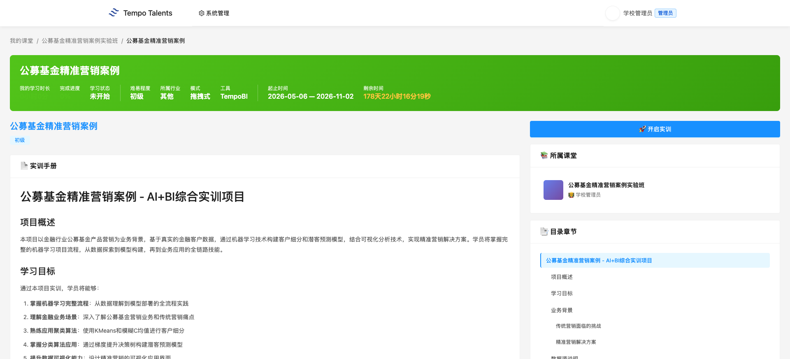
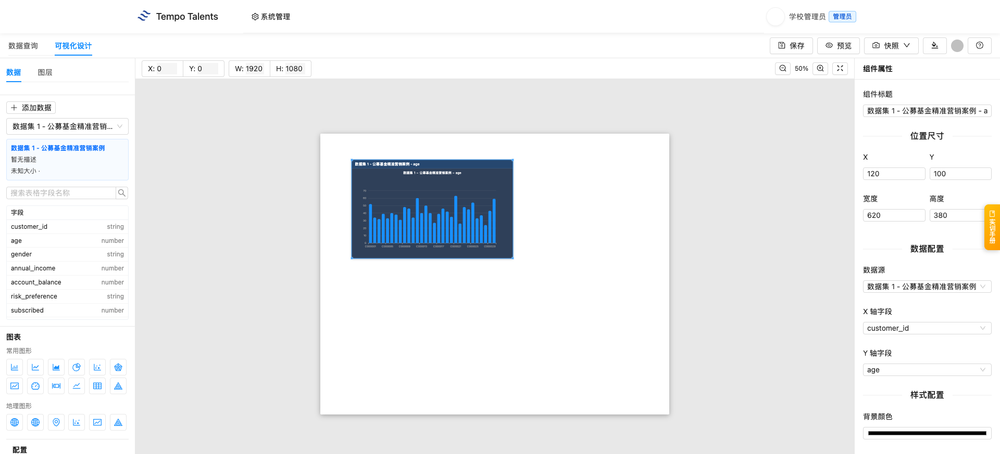
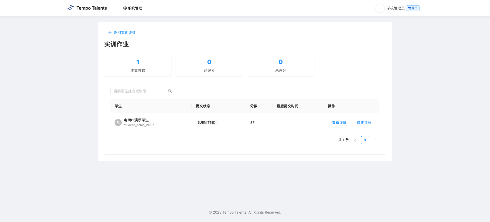
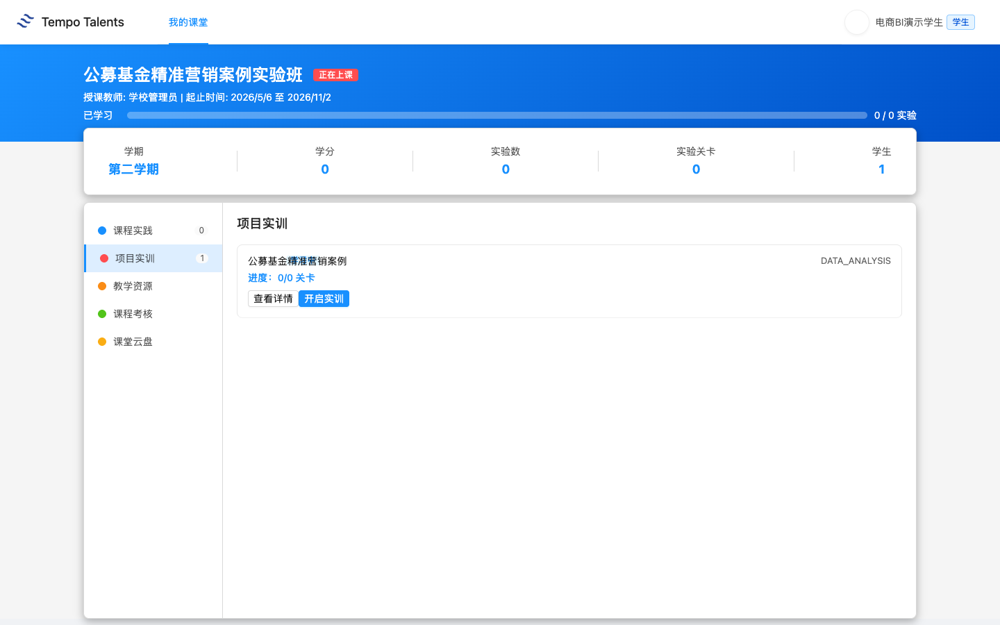
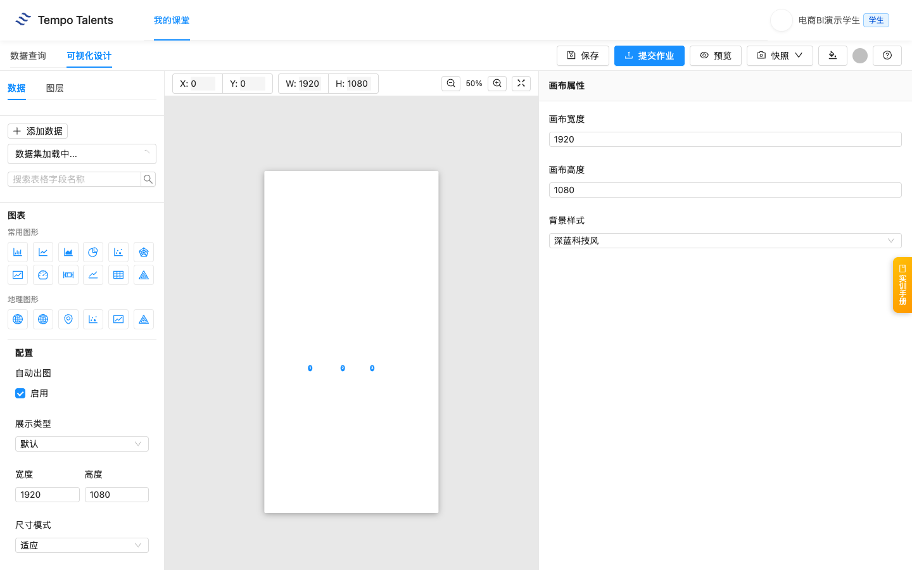
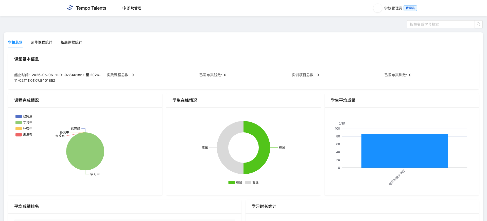
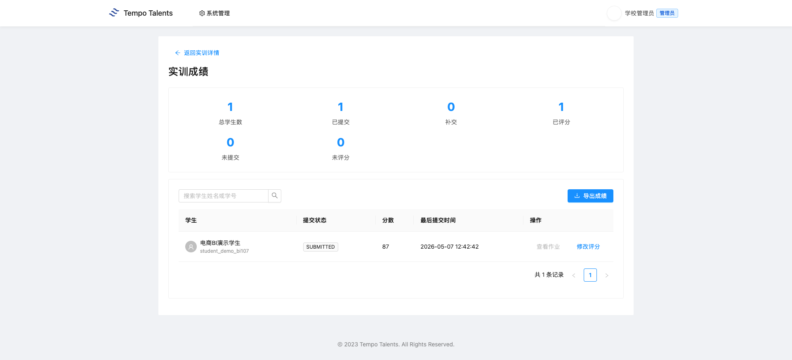

# 公募基金精准营销案例 - 教师上课指南 V3

适用课堂：公募基金精准营销案例实验班（classroom 1695）  
适用实训：公募基金精准营销案例（training 104）  
教师账号：school_admin  
学生演示账号：student_demo_bi107  
平台地址：学校内网 `http://192.168.109.42:3000`  
学校前端版本：以学校 `/assets/` 目录下当前 `index-xxxx.js` 为准

通用登录、账号、运维和排错流程见 [00-common.md](../00-common.md)。本文只保留“公募基金精准营销案例”课程特异内容。

## 快速导览

| 场景 | 老师先看 | 课堂动作 |
|---|---|---|
| 课前 5 分钟 | 顶部适用信息、账号和平台地址 | 登录教师账号，并用演示学生账号确认入口 |
| 开场讲解 | 第 1 章课程总览 | 用教学目标说明本课产出 |
| 课堂推进 | 第 3 章上课流程与关键演示 | 按 90 分钟节奏完成一次提交或作品 |
| 收尾核对 | 第 5 章教学管理 | 查看成绩、学情统计，并按需导出 Excel |
| 异常处理 | 第 6 章排错与求助 | 截图、记录课堂或任务 ID 后交给对应处理人 |

## 第 1 章 课程总览

### 1.1 课程定位与教学目标

这节课面向已经掌握基础 BI 操作、准备进入金融营销数据场景的老师。课程使用某基金公司的客户与交易数据，带学生完成客户画像、投资偏好观察、RFM 分层和精准营销建议输出，让学生理解“客户字段 - 行为指标 - 分层规则 - 营销动作”的完整路径。

学生学完后应能做三件事：读懂基金客户画像字段；在 BI 设计器中用年龄、收入、账户余额、交易次数、风险偏好等字段完成分布与分群分析；根据客户价值和投资偏好提出可执行的营销建议。学校环境核验显示 classroom 1695 已挂载 training 104，学生演示账号已加入课堂并完成一次提交，老师已评分 87 分。

### 1.2 知识技能矩阵

| 模块 | 老师讲授重点 | 学生练习结果 |
|---|---|---|
| 客户画像 | 年龄、性别、收入、账户余额、账户月数 | 能描述客户基础结构 |
| 投资行为 | 交易次数、最近交易间隔、基金持仓 | 能识别活跃客户和沉默客户 |
| 风险偏好 | risk_preference 与营销策略匹配 | 能按偏好设计推荐话术 |
| 精准营销 | subscribed、RFM 分层、目标客群筛选 | 能写出分层营销建议 |

### 1.3 学生交付物清单

本节课的学生交付物是一份基金客户精准营销 BI 看板：至少包含客户年龄或收入分布图、账户余额或基金持仓分析图、风险偏好分布图、交易活跃度分析图，并附 3 到 5 句客户分层和营销建议。学生在 BI 设计器内完成作品后点击“提交作业”，老师可在课堂作业列表中查看提交记录、评分并写点评。

## 第 2 章 课堂入口

1. 进入“我的课堂”或直接访问 `/#/classroom`。
2. 在课堂列表中找到“公募基金精准营销案例实验班”。
3. 点击课堂卡片进入详情页。首次加载详情页会拉取 BI 设计器相关资源，页面可能需要等待十几秒。

### 2.1 课堂详情页布局

课堂详情页左侧是功能菜单。老师本节课主要使用“项目实训”，辅助查看“学情分析”和“作业列表”。当前 1695 课堂的“项目实训”数量为 1，对应 training 104；页面也保留“课程实践”“教学资源”“课程考核”“课堂云盘”等入口。

## 第 3 章 项目实训：公募基金精准营销案例

### 3.1 training 104 整体结构

老师进入课堂后，默认看到“项目实训”标签。卡片显示“公募基金精准营销案例 / DATA_ANALYSIS”。点击“查看详情”后，平台展示实训手册。学校环境核验显示 training 104 的实训手册长度为 5510 字符，数据集数量为 2 个，课堂组织以客户画像、投资偏好、RFM 分层和营销方案评估为主线。

### 3.2 数据集说明

真实数据集有 2 个：`fund_customers.csv` 和 `fund_transactions.csv`。平台 BI 设计器当前加载到的字段包括 `customer_id`、`age`、`gender`、`annual_income`、`account_balance`、`risk_preference`、`subscribed`、`account_months`、`transaction_count`、`days_since_last_trans`、`fund_holdings`。

老师讲数据时不要从字段表逐行念。建议先问学生四个业务问题：哪些客户更值得重点维护；不同风险偏好客户应该推荐什么产品；交易次数和最近交易间隔能否反映活跃度；已认购客户和未认购客户有什么差异。然后让学生把问题映射到字段，例如客户价值用 `account_balance + fund_holdings`，活跃度用 `transaction_count + days_since_last_trans`，风险策略用 `risk_preference`。

### 3.3 90 分钟上课流程

| 时间 | 老师动作 | 学生动作 |
|---|---|---|
| 0-5 分钟 | 登录平台，打开 1695 课堂 | 准备浏览器 |
| 5-15 分钟 | 确认学生都进入课堂 | 登录并进入实验班 |
| 15-30 分钟 | 讲基金营销背景、客户画像字段和业务目标 | 找到字段含义 |
| 30-60 分钟 | 演示年龄分布、风险偏好分布和客户活跃度图 | 跟做图表 |
| 60-80 分钟 | 巡视学生独立练习 | 完成 4 个图表 |
| 80-90 分钟 | 总结客户分层和营销建议，说明提交要求 | 保存作品并提交作业 |

### 3.4 关键操作演示

老师演示时，先打开 BI 设计器，确认左侧数据集已加载，再做一个完整例子：把 `risk_preference` 作为分类字段，把客户数量作为统计指标，观察不同风险偏好客户占比；随后切换到 `annual_income`、`account_balance` 和 `transaction_count`，让学生比较客户价值与活跃度。

学生提交后，老师进入 training 104 的“作业列表”。页面会显示学生姓名、提交状态、提交时间、作业内容和点评入口。当前 V3 本次交付核验中，`student_demo_bi107` 已提交，老师已在作业页完成 87 分点评。

### 3.5 易错点提示

> **课堂提醒**：学生容易把 `annual_income` 当成投资收益。老师要提醒它是客户收入画像字段，不是基金产品收益。

> **课堂提醒**：`risk_preference` 是营销策略的重要分类字段，不应和 `account_balance` 混成一个数值指标解释。

> **课堂提醒**：`days_since_last_trans` 越大通常表示最近交易越久。学生解释活跃度时要注意方向，不能把数值大直接说成更活跃。

## 第 4 章 学生视角：学生看到什么

### 4.1 学生进入实验班

学生使用学校交付清单中的演示学生账号登录。通用登录步骤见 [00-common.md](../00-common.md)，本课只要求学生确认能看到“公募基金精准营销案例实验班”。学生端不会显示老师的系统管理入口，只显示自己的课堂和学习入口。

学生点击“开启实训”后进入 BI 设计器。学校环境核验显示：数据集能加载，字段能展示，学生可以保存当前 BI 场景，并点击“提交作业”。提交接口返回 `code=0000`，平台已记录学生提交进度。

1. 点击“开启实训”。
2. 在 BI 设计器中完成图表。
3. 点击“保存”保存当前场景。
4. 点击“提交作业”完成课堂提交。

### 4.2 学生求助路径

学生遇到问题时，老师先判断是账号问题、课堂加入问题，还是实训操作问题。账号问题由信息中心处理；课堂加入问题由学校管理员检查学生是否在 classroom 1695；图表不会做时，老师回到字段和业务问题，帮助学生重新选择客户画像字段、行为字段和分层字段。

## 第 5 章 教学管理

### 5.1 班级学生进度查看

老师进入“学情分析”可以看到学情总览、必修课程统计、拓展课程统计。本次交付核验中，演示学生提交后由老师评分 87 分；学情页面可正常打开，统计区可用于课堂进度查看。

### 5.2 作业点评与评分

老师在作业详情页点击“点评作业”，输入分数和点评意见后确认。交付核验评分为 87 分，提交后页面显示学生提交记录和教师评分结果。

### 5.3 成绩统计与导出

在“必修课程统计”页，平台提供学生列表、完成情况、平均分和导出入口。老师在正式课堂中应先完成评分，再刷新统计页核对实训完成数和平均分；如统计尚未刷新，优先确认学生是否已提交、老师是否已点评。

## 第 6 章 排错与求助

通用账号、网络、课堂加入、未授权、提交失败等排错流程见 [00-common.md](../00-common.md)。本课老师重点关注以下课程特异问题：

| 问题 | 老师先做什么 | 后续处理 |
|---|---|---|
| 学生不知道分析什么 | 回到基金营销背景，先定业务问题 | 从风险偏好分布做第一个示范 |
| 学生字段选错 | 检查分类字段与数值字段是否混用 | 用 `risk_preference` 或 `gender` 做分类例子 |
| 学生误读交易活跃度 | 检查 `days_since_last_trans` 的解释方向 | 结合 `transaction_count` 一起判断 |
| 老师看不到作业 | 确认学生是否已点击“提交作业” | 未提交时先让学生回 BI 设计器提交 |

## 附录

### A. 教学要点提示

老师不要只讲工具按钮，要把每个图表和营销动作绑定：客户画像回答“客户是谁”，风险偏好回答“适合什么产品”，交易活跃度回答“什么时候触达”，认购状态回答“营销是否转化”。课堂总结时让学生用一句业务语言解释图表，而不是只说“我做了柱状图”。

### B. 与课程标准的对应

本课对应数据分析基础、商业智能工具应用、金融营销数据理解、客户分层与业务表达四类能力。评价时建议同时看图表完整性、字段选择准确性、客户分层逻辑和营销建议可操作性。
