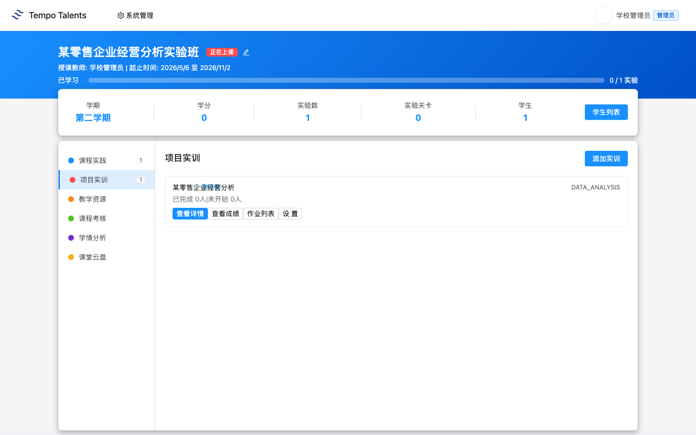
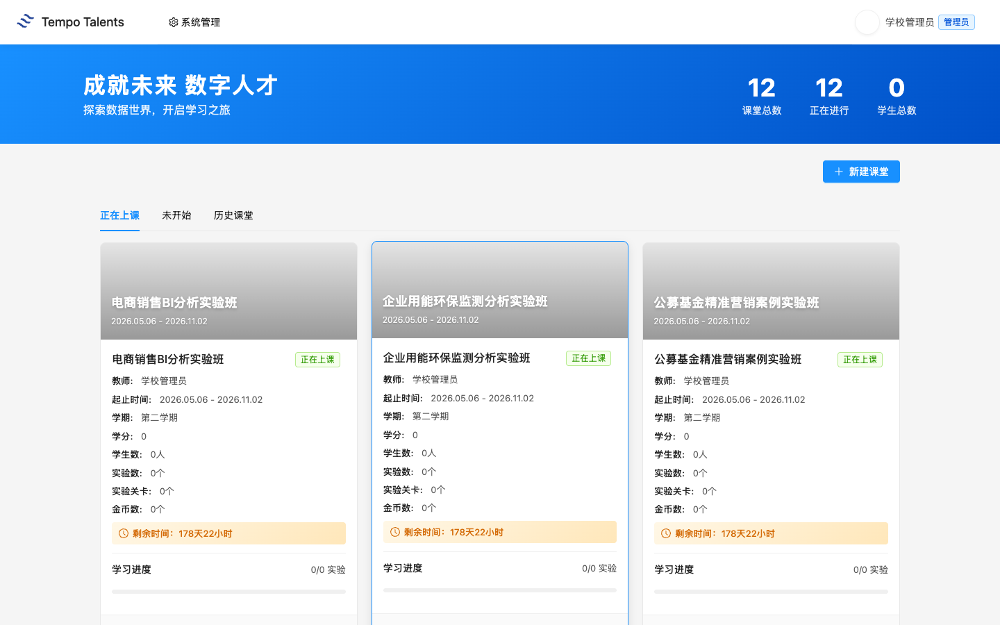
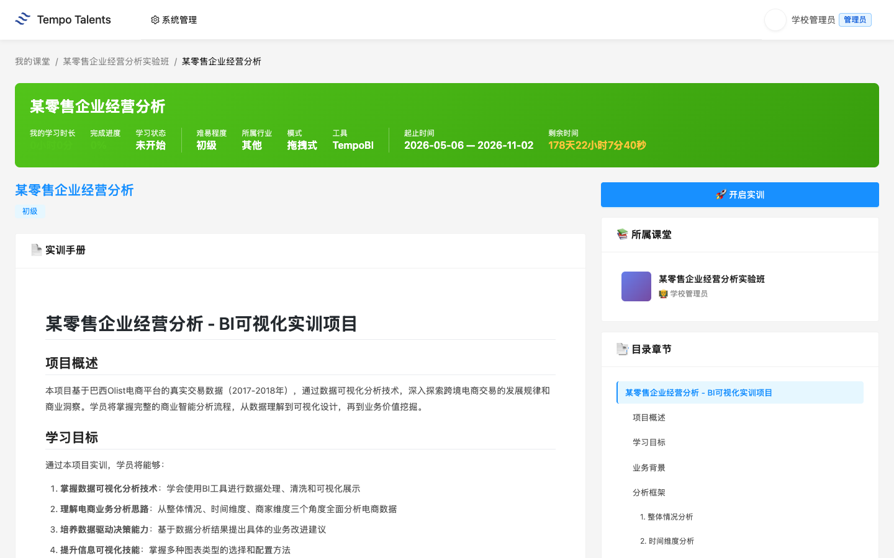
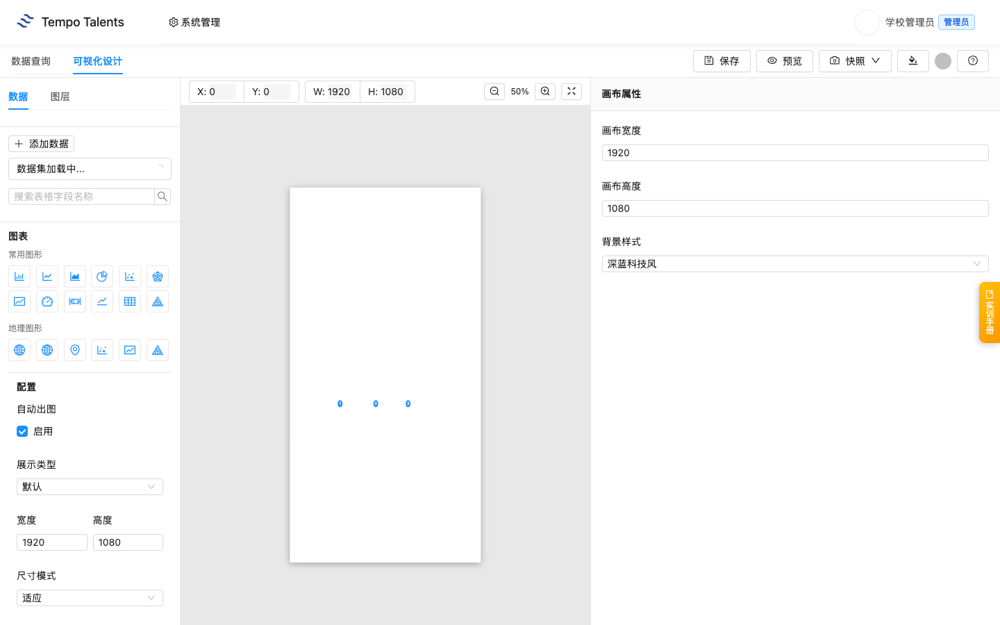
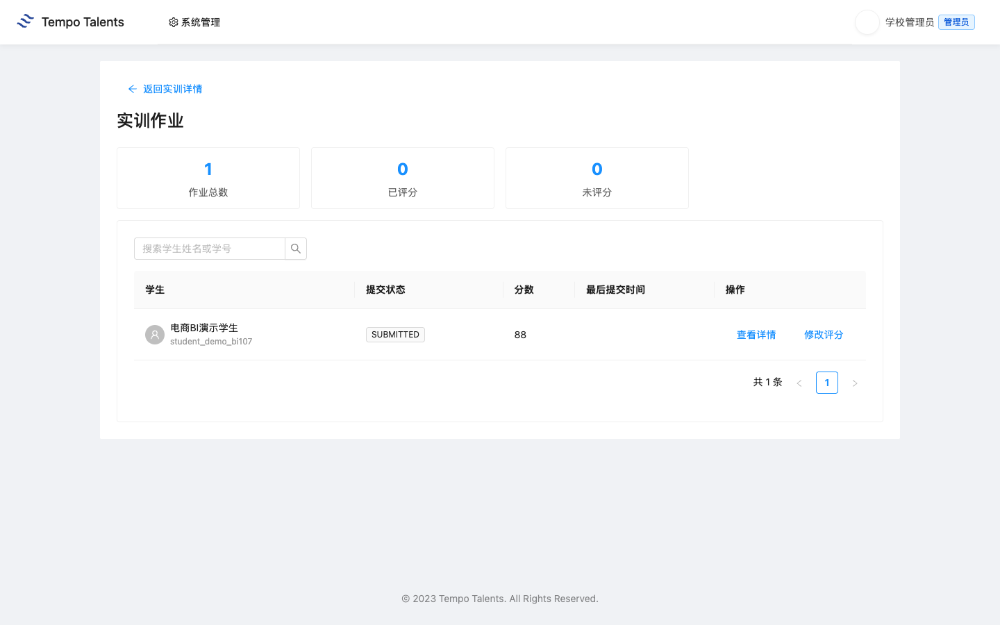
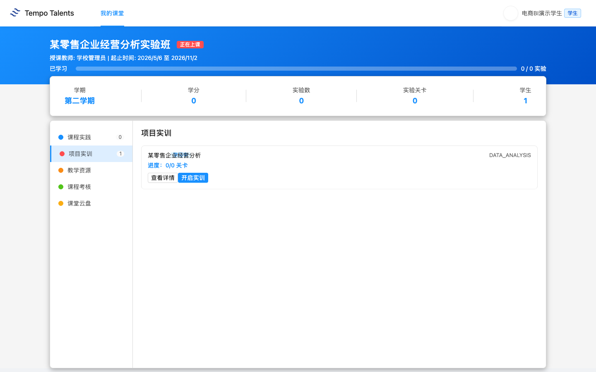
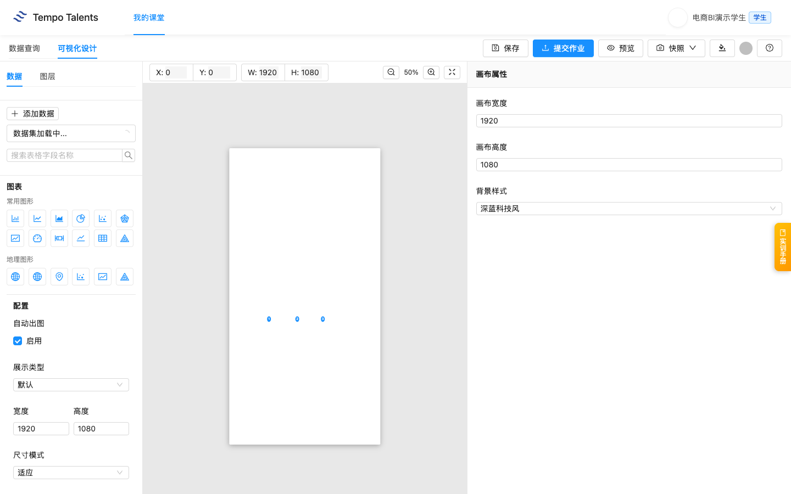
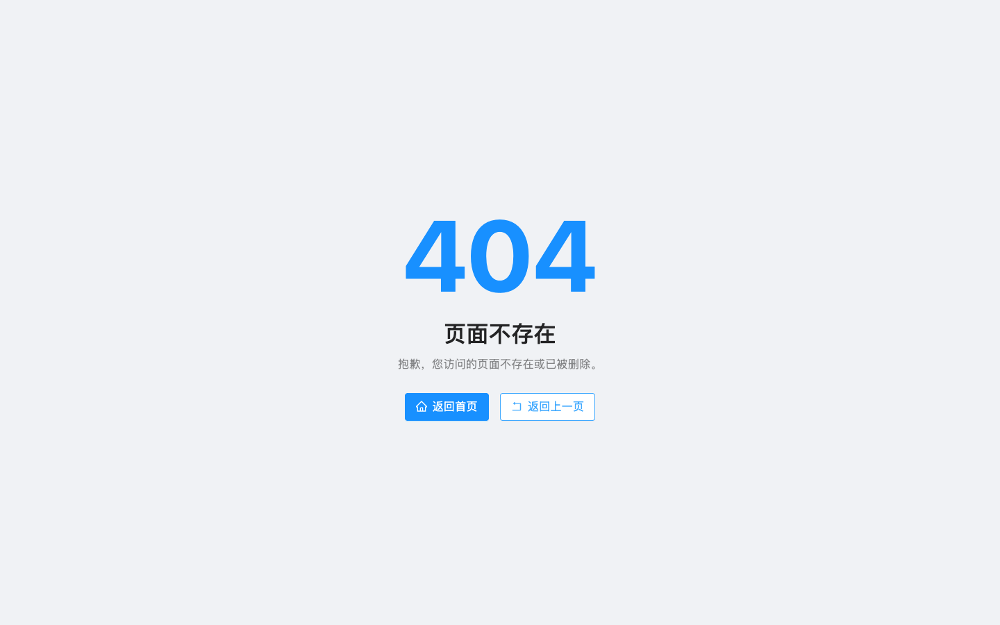

# 某零售企业经营分析 - 教师上课指南 V4

适用课堂：某零售企业经营分析实验班（classroom 1697）  
适用实训：某零售企业经营分析（training 108）  
教师账号：school_admin  
学生演示账号：student_demo_bi107  
平台地址：学校内网 `http://<慧学内网IP-1>:3000`  
学校前端版本：以学校 `/assets/` 目录下当前 `index-xxxx.js` 为准

通用登录、账号、运维和排错流程见 [00-common.md](../00-common.md)。本文只保留“某零售企业经营分析”课程特异内容。

## 快速导览

| 场景 | 老师先看 | 课堂动作 |
|---|---|---|
| 课前 5 分钟 | 顶部适用信息、账号和平台地址 | 登录教师账号，并用演示学生账号确认入口 |
| 开场讲解 | 第 1 章课程总览 | 用教学目标说明本课产出 |
| 课堂推进 | 第 3 章上课流程与关键演示 | 按 90 分钟节奏完成一次提交或作品 |
| 收尾核对 | 第 5 章教学管理 | 查看成绩、学情统计，并按需导出 Excel |
| 异常处理 | 第 6 章排错与求助 | 截图、记录课堂或任务 ID 后交给对应处理人 |

## 第 1 章 课程总览

### 1.1 课程定位与教学目标

这节课面向已经完成基础 BI 操作训练、准备进入零售经营数据场景的老师。课程使用某连锁零售企业门店经营数据，带学生完成门店绩效排名、商品动销分析、库存周转优化和会员消费行为分析，让学生理解“销售事实 - 门店/商品维度 - 经营指标 - 管理建议”的完整路径。

学生学完后应能做三件事：读懂零售订单与门店经营数据；在 BI 设计器中围绕销售额、门店、商品、库存和会员行为构建图表；根据图表提出门店经营和库存优化建议。学校环境核验显示 classroom 1697 已挂载 training 108，学生演示账号已加入课堂并完成一次提交，老师已评分 88 分。

### 1.2 知识技能矩阵

| 模块 | 老师讲授重点 | 学生练习结果 |
|---|---|---|
| 门店绩效 | 门店之间的销售额、客单价和订单量差异 | 能做门店排名图 |
| 商品动销 | 热销商品、滞销商品和品类结构 | 能识别重点商品 |
| 库存周转 | 库存压力和补货优先级 | 能提出库存优化建议 |
| 会员消费 | 会员消费频次、金额和偏好 | 能做客户运营建议 |

### 1.3 学生交付物清单

本节课的学生交付物是一份零售经营 BI 看板：至少包含门店绩效排行、商品动销对比、库存周转观察、会员消费行为分析，并附 3 到 5 句业务结论。学生在 BI 设计器内完成作品后点击“提交作业”，老师可在课堂作业列表中查看提交记录、评分并写点评。

## 第 2 章 课堂入口

1. 进入“我的课堂”或直接访问 `/#/classroom`。
2. 在课堂列表中找到“某零售企业经营分析实验班”。
3. 点击课堂卡片进入详情页。首次加载详情页会拉取 BI 设计器相关资源，页面可能需要等待十几秒。

### 2.1 课堂详情页布局

课堂详情页左侧是功能菜单。老师本节课主要使用“项目实训”，辅助查看“学情分析”和“作业列表”。当前 1697 课堂的“项目实训”数量为 1，对应 training 108；页面也保留“课程实践”“教学资源”“课程考核”“课堂云盘”等入口。

## 第 3 章 项目实训：某零售企业经营分析

### 3.1 training 108 整体结构

老师进入课堂后，默认看到“项目实训”标签。卡片显示“某零售企业经营分析 / DATA_ANALYSIS”。点击“查看详情”后，平台展示实训手册。学校环境核验显示 training 108 的实训手册长度为 2071 字符，数据集数量为 2 个，课堂组织以门店经营、商品动销、库存周转和会员消费为主线。

### 3.2 数据集说明

真实数据集有 2 个：`orders_merged.csv` 和 `orders_merged_sample.csv`。老师讲数据时建议围绕四个业务问题展开：哪类门店销售表现最好；哪些商品动销快或慢；库存周转是否影响销售；会员消费是否存在高价值客群。

演示时先让学生用门店和商品维度做聚合，再逐步加入会员和库存视角。这样学生不会只停留在“销售额排名”，而能把图表解释成经营动作，例如重点门店复盘、滞销商品清理、会员复购运营和补货优先级调整。

### 3.3 90 分钟上课流程

| 时间 | 老师动作 | 学生动作 |
|---|---|---|
| 0-5 分钟 | 登录平台，打开 1697 课堂 | 准备浏览器 |
| 5-15 分钟 | 确认学生都进入课堂 | 登录并进入实验班 |
| 15-30 分钟 | 讲零售经营指标、门店和商品维度 | 找到分析维度 |
| 30-60 分钟 | 演示门店绩效排行和商品动销图 | 跟做图表 |
| 60-80 分钟 | 巡视学生独立练习 | 完成 4 个图表 |
| 80-90 分钟 | 总结经营建议，说明提交要求 | 保存作品并提交作业 |

### 3.4 关键操作演示

老师演示时，先打开 BI 设计器，确认数据集已加载，再做一个完整例子：用门店维度统计销售表现，观察高低差异；随后切换到商品、库存和会员维度，让学生比较不同经营视角下的结论是否一致。

学生提交后，老师进入 training 108 的“作业列表”。页面会显示学生姓名、提交状态、提交时间、作业内容和点评入口。当前 V4 本次交付核验中，`student_demo_bi107` 已提交，老师已在作业页完成 88 分点评。

### 3.5 易错点提示

> **课堂提醒**：学生容易只看销售额排名，忽略库存和会员行为。老师要提醒学生把“卖得好”拆成门店、商品、库存和会员四个原因。

> **课堂提醒**：零售图表不要只做总量对比。建议至少加入一个“门店”或“商品”维度，避免结论过粗。

> **课堂提醒**：经营建议要对应图表证据。不能只写“加强营销”，应写清针对哪个门店、哪个商品或哪类会员。

## 第 4 章 学生视角：学生看到什么

### 4.1 学生进入实验班

学生使用学校交付清单中的演示学生账号登录。通用登录步骤见 [00-common.md](../00-common.md)，本课只要求学生确认能看到“某零售企业经营分析实验班”。学生端不会显示老师的系统管理入口，只显示自己的课堂和学习入口。

学生点击“开启实训”后进入 BI 设计器。学校环境核验显示：学生可以进入 BI 设计器，保存当前 BI 场景，并点击“提交作业”。提交接口返回 `code=0000`，平台已记录学生提交进度。

1. 点击“开启实训”。
2. 在 BI 设计器中完成图表。
3. 点击“保存”保存当前场景。
4. 点击“提交作业”完成课堂提交。

### 4.2 学生求助路径

学生遇到问题时，老师先判断是账号问题、课堂加入问题，还是实训操作问题。账号问题由信息中心处理；课堂加入问题由学校管理员检查学生是否在 classroom 1697；图表不会做时，老师回到字段和业务问题，帮助学生重新选择门店、商品、库存或会员视角。

## 第 5 章 教学管理

### 5.1 班级学生进度查看

老师进入“学情分析”可以看到学情总览、必修课程统计、拓展课程统计。本次交付核验中，演示学生提交后由老师评分 88 分；学情页面可正常打开，统计区可用于课堂进度查看。

### 5.2 作业点评与评分

老师在作业详情页点击“点评作业”，输入分数和点评意见后确认。交付核验评分为 88 分，提交后页面显示学生提交记录和教师评分结果。

### 5.3 成绩统计与导出

在“必修课程统计”页，平台提供学生列表、完成情况、平均分和导出入口。老师在正式课堂中应先完成评分，再刷新统计页核对实训完成数和平均分；如统计尚未刷新，优先确认学生是否已提交、老师是否已点评。

## 第 6 章 排错与求助

通用账号、网络、课堂加入、未授权、提交失败等排错流程见 [00-common.md](../00-common.md)。本课老师重点关注以下课程特异问题：

| 问题 | 老师先做什么 | 后续处理 |
|---|---|---|
| 学生不知道分析什么 | 回到门店经营背景，先定业务问题 | 从门店绩效排行做第一个示范 |
| 学生图表过粗 | 检查是否只做总销售额 | 增加门店、商品或会员维度 |
| 经营建议空泛 | 要求学生指出图表证据 | 把建议绑定到具体门店或商品 |
| 老师看不到作业 | 确认学生是否已点击“提交作业” | 未提交时先让学生回 BI 设计器提交 |

## 附录

### A. 教学要点提示

老师不要只讲工具按钮，要把每个图表和零售经营动作绑定：门店排行回答“谁表现好”，商品动销回答“卖什么”，库存周转回答“压在哪里”，会员消费回答“服务谁”。课堂总结时让学生用一句经营语言解释图表，而不是只说“我做了柱状图”。

### B. 与课程标准的对应

本课对应数据分析基础、商业智能工具应用、零售经营数据理解、业务问题分析四类能力。评价时建议同时看图表完整性、维度选择准确性、经营结论表达和建议可操作性。
