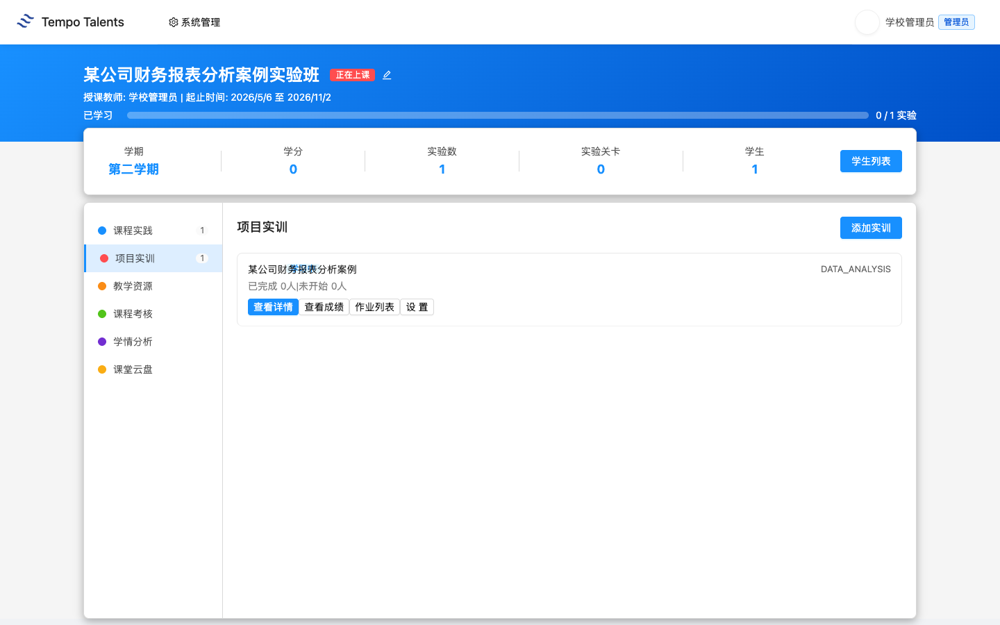
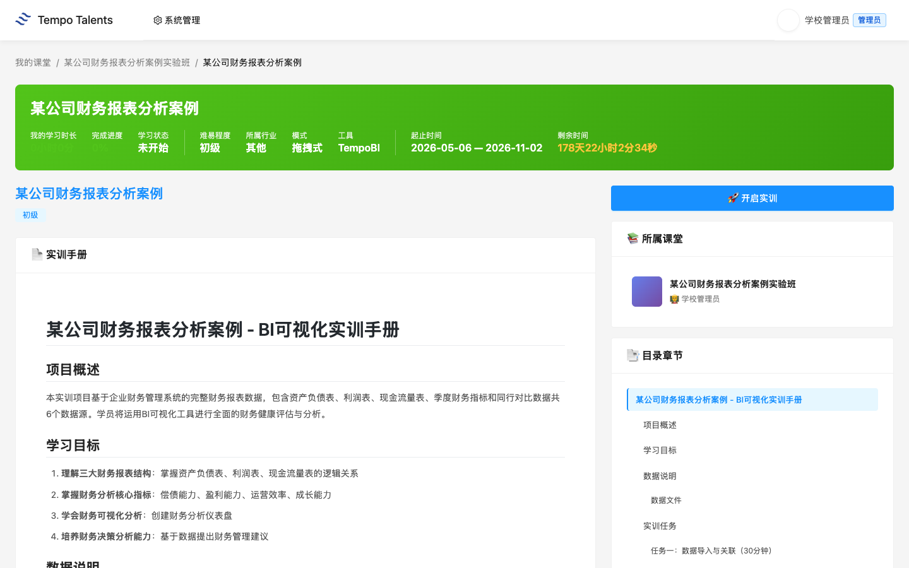
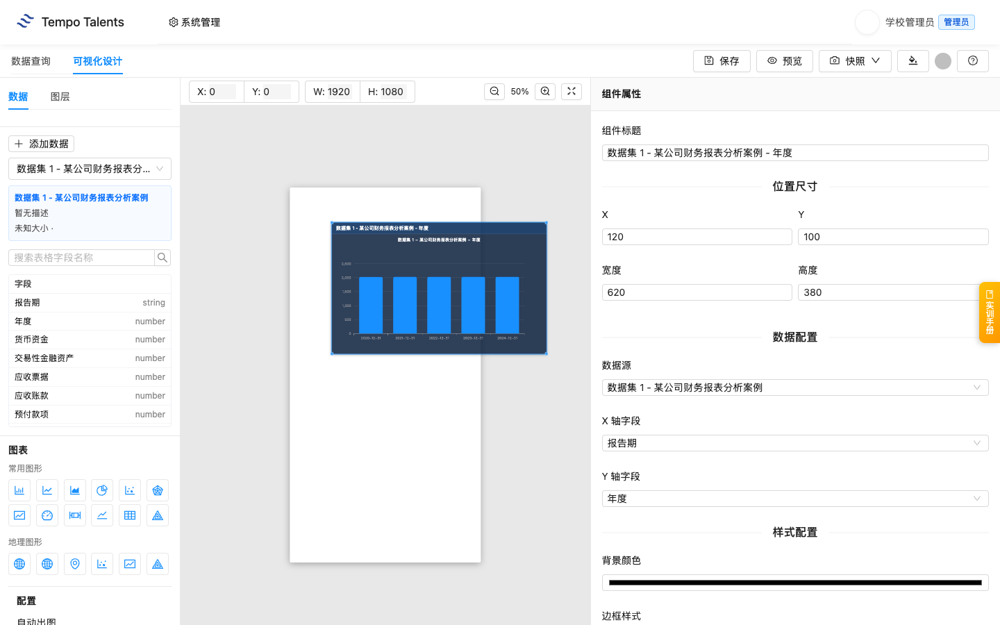
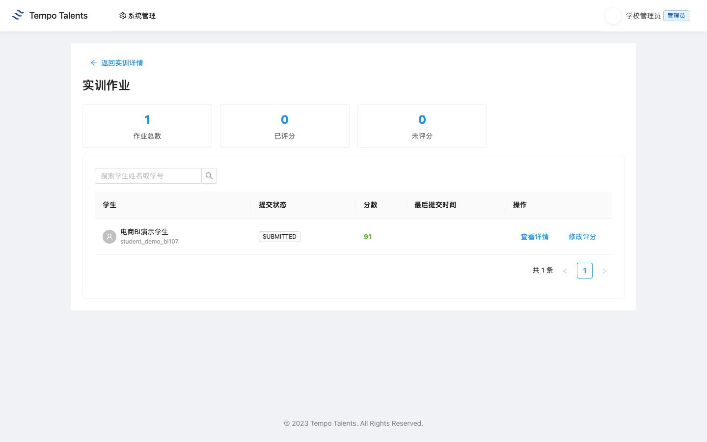
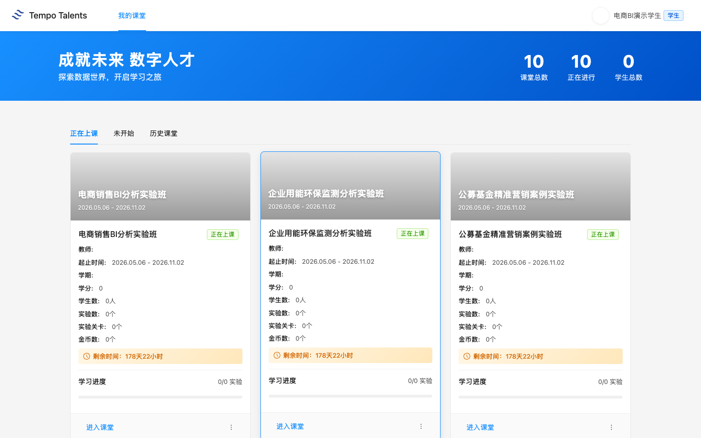
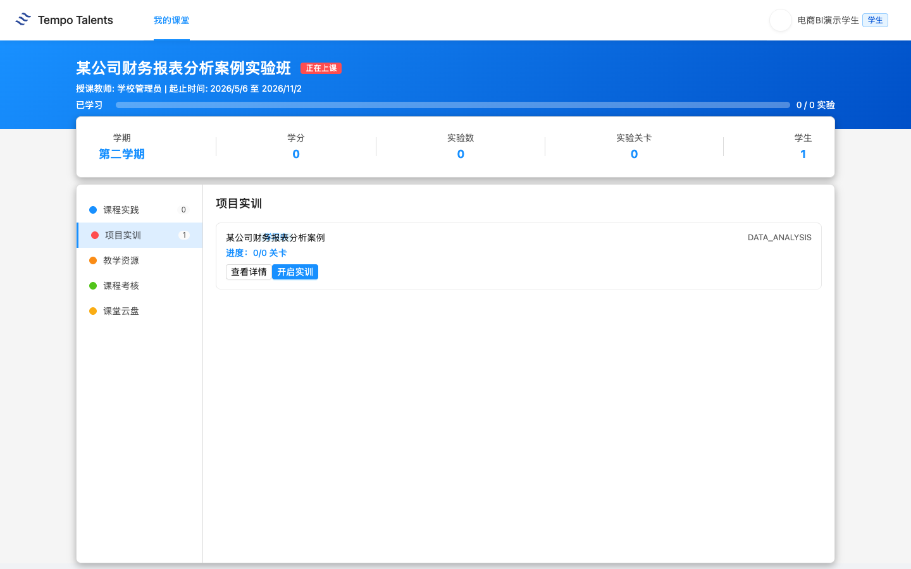
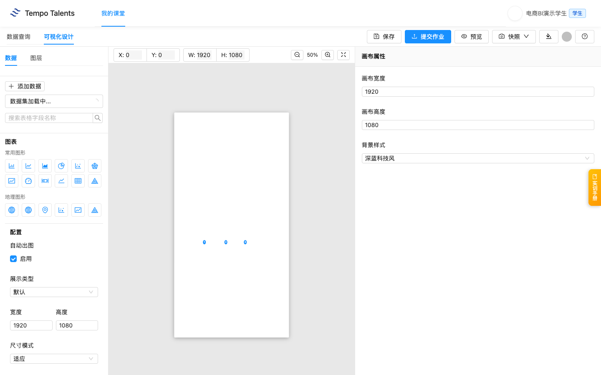

# 某公司财务报表分析案例 - 教师上课指南 V7

适用课堂：某公司财务报表分析案例实验班（classroom 1700）  
适用实训：某公司财务报表分析案例（training 111）  
教师账号：school_admin  
学生演示账号：student_demo_bi107  
平台地址：学校内网 `http://192.168.109.42:3000`  
学校前端版本：以学校 `/assets/` 目录下当前 `index-xxxx.js` 为准

通用登录、账号、运维和排错流程见 [00-common.md](../00-common.md)。本文只保留“某公司财务报表分析案例”课程特异内容。

## 快速导览

| 场景 | 老师先看 | 课堂动作 |
|---|---|---|
| 课前 5 分钟 | 顶部适用信息、账号和平台地址 | 登录教师账号，并用演示学生账号确认入口 |
| 开场讲解 | 第 1 章课程总览 | 用教学目标说明本课产出 |
| 课堂推进 | 第 3 章上课流程与关键演示 | 按 90 分钟节奏完成一次提交或作品 |
| 收尾核对 | 第 5 章教学管理 | 查看成绩、学情统计，并按需导出 Excel |
| 异常处理 | 第 6 章排错与求助 | 截图、记录课堂或任务 ID 后交给对应处理人 |

## 第 1 章 课程总览

### 1.1 课程定位与教学目标

这节课面向已经完成基础数据分析训练、准备进入财务报表分析场景的老师。课程围绕资产负债、利润趋势、现金流健康度和财务比率组织教学，让学生理解“业务问题 - 数据字段 - 图表证据 - 管理建议”的完整路径。

学生学完后应能做三件事：读懂财务报表分析数据中的关键维度；在平台实训页面中围绕资产负债、利润趋势、现金流健康度和财务比率构建分析结果；根据图表或实训结果提出可执行建议。学校环境核验显示 classroom 1700 已挂载 training 111，学生演示账号已加入课堂并完成一次提交，老师已评分 91 分。

### 1.2 知识技能矩阵

| 模块 | 老师讲授重点 | 学生练习结果 |
|---|---|---|
| 资产负债 | 资产、负债和所有者权益结构 | 能看出财务结构变化 |
| 利润趋势 | 收入、成本和利润变化 | 能解释盈利能力 |
| 现金流 | 经营、投资、筹资现金流 | 能判断现金流健康度 |
| 比率对标 | 偿债、营运、盈利指标 | 能做同业比较 |

### 1.3 学生交付物清单

本节课的学生交付物是一份“某公司财务报表分析案例”分析作品：至少覆盖资产负债、利润趋势、现金流健康度和财务比率，并附 3 到 5 句业务结论。学生完成作品后点击“提交作业”，老师可在课堂作业列表中查看提交记录、评分并写点评。

## 第 2 章 课堂入口

1. 进入“我的课堂”或直接访问 `/#/classroom`。
2. 在课堂列表中找到“某公司财务报表分析案例实验班”。
3. 点击课堂卡片进入详情页。首次加载详情页会拉取项目实训相关资源，页面可能需要等待十几秒。

### 2.1 课堂详情页布局

课堂详情页左侧是功能菜单。老师本节课主要使用“项目实训”，辅助查看“学情分析”和“作业列表”。当前 1700 课堂的“项目实训”数量为 1，对应 training 111；页面也保留“课程实践”“教学资源”“课程考核”“课堂云盘”等入口。

## 第 3 章 项目实训：某公司财务报表分析案例

### 3.1 training 111 整体结构

老师进入课堂后，默认看到“项目实训”标签。卡片显示“某公司财务报表分析案例 / DATA_ANALYSIS”。点击“查看详情”后，平台展示实训手册。学校环境核验显示 training 111 的实训手册长度为 1176 字符，数据集数量为 6 个，课堂组织以资产负债、利润趋势、现金流健康度和财务比率为主线。

### 3.2 数据集说明

真实数据集文件为：balance_sheet.csv、cash_flow_statement.csv、financial_statements.csv、income_statement.csv、peer_comparison.csv、quarterly_financials.csv。老师讲数据时建议围绕四个业务问题展开：资产负债结构是否稳健；利润增长来自哪里；现金流是否支撑业务增长；财务比率是否优于同业。

演示时先让学生确认数据集已加载，再从一个最容易解释的业务问题切入。不要让学生只堆图表；每张图都要能回答一个业务问题，并能转化为一句管理建议。

### 3.3 90 分钟上课流程

| 时间 | 老师动作 | 学生动作 |
|---|---|---|
| 0-5 分钟 | 登录平台，打开 1700 课堂 | 准备浏览器 |
| 5-15 分钟 | 确认学生都进入课堂 | 登录并进入实验班 |
| 15-30 分钟 | 讲财务报表分析背景和关键数据维度 | 找到分析维度 |
| 30-60 分钟 | 演示资产负债分析路径 | 跟做图表或实训步骤 |
| 60-80 分钟 | 巡视学生独立练习 | 完成分析作品 |
| 80-90 分钟 | 总结业务建议，说明提交要求 | 保存作品并提交作业 |

### 3.4 关键操作演示

老师演示时，先打开实训入口，确认页面与数据资源已加载，再做一个完整例子：从资产负债切入，说明为什么选择这个视角、使用哪些数据、图表或结果能支持什么结论。学生独立练习时，要求每个图表都写一句解释。

学生提交后，老师进入 training 111 的“作业列表”。页面会显示学生姓名、提交状态、提交时间、作业内容和点评入口。当前 V7 本次交付核验中，`student_demo_bi107` 已提交，老师已在作业页完成 91 分点评。

### 3.5 易错点提示

> **课堂提醒**：学生容易只做总量图，忽略业务维度。老师要追问“按什么对象比较”和“这个差异说明什么”。

> **课堂提醒**：结论不能脱离图表证据。每条建议都要能回指到页面里的一个图表、指标或实训结果。

> **课堂提醒**：学生提交前要确认已点击“提交作业”。只保存作品不等于老师能在作业列表看到提交。

## 第 4 章 学生视角：学生看到什么

### 4.1 学生进入实验班

学生使用学校交付清单中的演示学生账号登录。通用登录步骤见 [00-common.md](../00-common.md)，本课只要求学生确认能看到“某公司财务报表分析案例实验班”。学生端不会显示老师的系统管理入口，只显示自己的课堂和学习入口。

学生点击“开启实训”后进入实训页面。学校环境核验显示：学生可以进入实训入口，保存当前作品，并点击“提交作业”。提交接口返回 `code=0000`，平台已记录学生提交进度。

1. 点击“开启实训”。
2. 完成图表或实训步骤。
3. 点击“保存”保存当前作品。
4. 点击“提交作业”完成课堂提交。

### 4.2 学生求助路径

学生遇到问题时，老师先判断是账号问题、课堂加入问题，还是实训操作问题。账号问题由信息中心处理；课堂加入问题由学校管理员检查学生是否在 classroom 1700；实训不会做时，老师回到本课业务问题，帮助学生重新选择分析对象和指标。

## 第 5 章 教学管理

### 5.1 班级学生进度查看

老师进入“学情分析”可以看到学情总览、必修课程统计、拓展课程统计。本次交付核验中，演示学生提交后由老师评分 91 分；学情页面可正常打开，统计区可用于课堂进度查看。

### 5.2 作业点评与评分

老师在作业详情页点击“点评作业”，输入分数和点评意见后确认。交付核验评分为 91 分，提交后页面显示学生提交记录和教师评分结果。

### 5.3 成绩统计与导出

在“必修课程统计”页，平台提供学生列表、完成情况、平均分和导出入口。老师在正式课堂中应先完成评分，再刷新统计页核对实训完成数和平均分；如统计尚未刷新，优先确认学生是否已提交、老师是否已点评。

## 第 6 章 排错与求助

通用账号、网络、课堂加入、未授权、提交失败等排错流程见 [00-common.md](../00-common.md)。本课老师重点关注以下课程特异问题：

| 问题 | 老师先做什么 | 后续处理 |
|---|---|---|
| 学生不知道分析什么 | 回到财务报表分析背景，先定业务问题 | 从资产负债做第一个示范 |
| 学生图表过粗 | 检查是否只有总量，没有维度 | 增加业务对象或时间维度 |
| 业务建议空泛 | 要求学生指出图表证据 | 把建议绑定到具体指标 |
| 老师看不到作业 | 确认学生是否已点击“提交作业” | 未提交时先让学生回实训页面提交 |

## 附录

### A. 教学要点提示

老师不要只讲工具按钮，要把每个图表和财务报表分析动作绑定。课堂总结时让学生用一句业务语言解释图表，而不是只说“我做了柱状图”。

### B. 与课程标准的对应

本课对应数据分析基础、商业智能工具应用、财务报表分析数据理解、业务问题分析四类能力。评价时建议同时看图表完整性、维度选择准确性、业务结论表达和建议可操作性。
